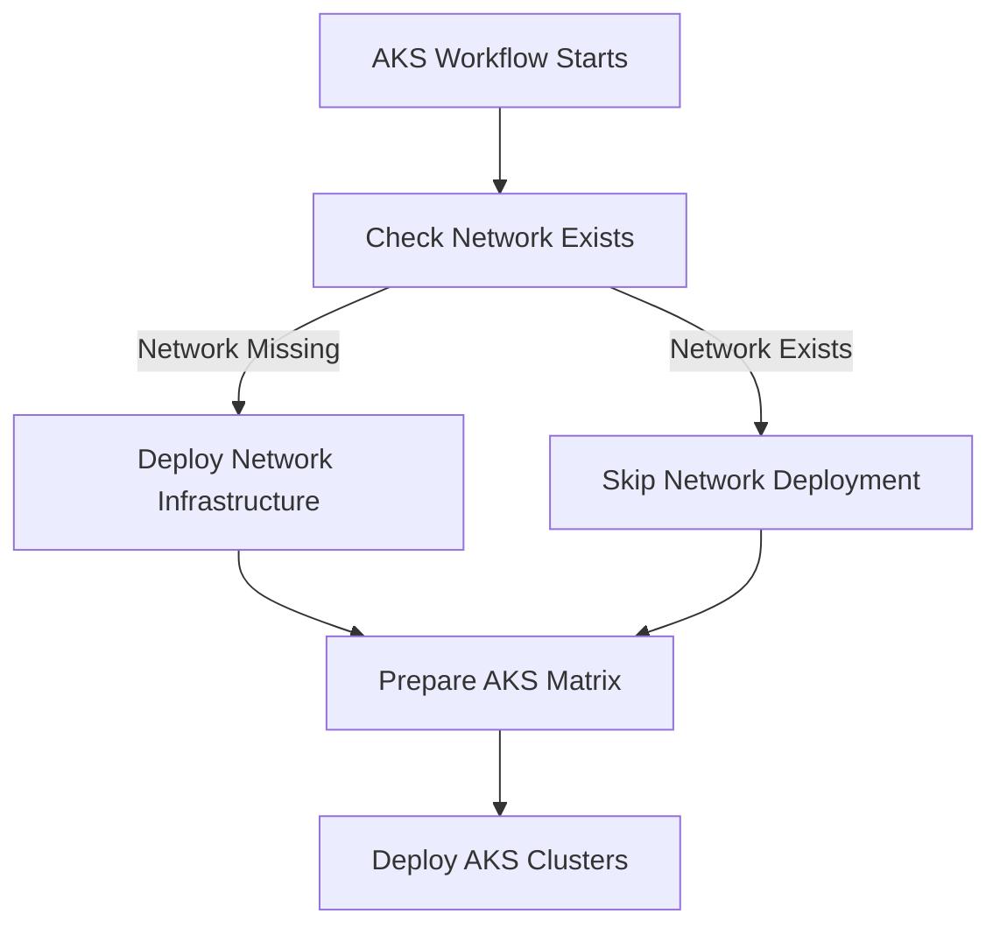

# AKS Workflow with Automatic Network Deployment

## ✅ Changes Made

### 1. **Reverted Auto-scaling Configuration**
Removed `enable_auto_scaling` from the default node pool as it was causing errors with the AzureRM provider.

**Before:**
```hcl
default_node_pool {
  enable_auto_scaling = true  # ❌ Causing error
  min_count = 2
  max_count = 4
}
```

**After:**
```hcl
default_node_pool {
  node_count = var.system_node_count  # ✅ Simple fixed count
  # Auto-scaling can be added to separate node pools later
}
```

### 2. **Added Automatic Network Deployment to AKS Workflow**

The AKS workflow now automatically:
1. **Checks if network exists** before deploying AKS
2. **Deploys network if missing** automatically
3. **Proceeds with AKS deployment** after network is ready

## 📋 New Workflow Structure



## 🚀 How It Works

### **Job 1: check-network**
Checks if the network infrastructure exists:
```yaml
- Checks for resource group: rg-msdp-network-dev
- Checks for VNet: vnet-msdp-dev
- Sets output: should-deploy=true/false
```

### **Job 2: deploy-network** (Conditional)
Only runs if network doesn't exist:
```yaml
- Generates network terraform.tfvars.json
- Sets up Terraform backend
- Runs terraform apply for network
```

### **Job 3: prepare**
Runs after network check/deployment:
```yaml
- Generates AKS cluster matrix
- Prepares cluster configurations
```

### **Job 4: deploy**
Deploys AKS clusters:
```yaml
- Uses existing or newly created network
- Deploys each cluster from matrix
```

## 🎯 Benefits

1. **No Manual Steps**: Network is automatically created if missing
2. **Idempotent**: Safe to run multiple times
3. **Self-Healing**: If network is deleted, it's automatically recreated
4. **Single Command**: One workflow handles everything

## 📊 Usage

### **Simple Deployment**
```bash
# This single command will:
# 1. Check if network exists
# 2. Create network if missing
# 3. Deploy AKS clusters
gh workflow run aks.yml -f action=apply -f environment=dev
```

### **Plan Only**
```bash
# See what would be created
gh workflow run aks.yml -f action=plan -f environment=dev
```

### **Deploy Specific Cluster**
```bash
# Deploy only one cluster (network still auto-created if needed)
gh workflow run aks.yml -f action=apply -f environment=dev -f cluster_name=aks-msdp-dev-01
```

## 🔍 Monitoring

The workflow will show clear status:
```
✅ Resource group exists
✅ VNet exists
→ Skipping network deployment

OR

⚠️ Resource group not found
→ Deploying network infrastructure...
✅ Network infrastructure deployed successfully
→ Proceeding with AKS deployment...
```

## 🛠️ Troubleshooting

### **If Network Deployment Fails**
The workflow will stop and show the error. Fix the issue and rerun.

### **If AKS Deployment Fails**
The network will already be created, so next run will skip network deployment.

### **Force Network Redeployment**
If you need to recreate the network:
```bash
# First destroy network
gh workflow run azure-network.yml -f action=destroy -f environment=dev

# Then run AKS workflow (will recreate network)
gh workflow run aks.yml -f action=apply -f environment=dev
```

## 📝 Configuration

The workflow uses the same `config/dev.yaml` for both network and AKS:

```yaml
azure:
  network:
    resource_group_name: rg-msdp-network-dev
    vnet_name: vnet-msdp-dev
    vnet_cidr: 10.60.0.0/16
    subnets:
      - name: snet-aks-system-dev
        cidr: 10.60.1.0/24
      - name: snet-aks-user-dev
        cidr: 10.60.2.0/24
  
  aks:
    clusters:
      - name: aks-msdp-dev-01
        subnet_name: snet-aks-system-dev
      - name: aks-msdp-dev-02
        subnet_name: snet-aks-user-dev
```

## ✅ Summary

- **Auto-scaling issue**: Fixed by reverting to simple node_count
- **Network dependency**: Solved with automatic network deployment
- **Single workflow**: Handles both network and AKS deployment
- **No manual steps**: Everything is automated

Now you can run the AKS workflow and it will automatically create the network if it doesn't exist!