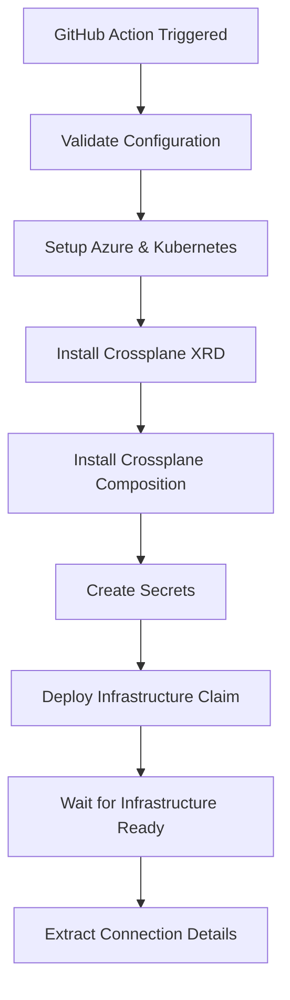
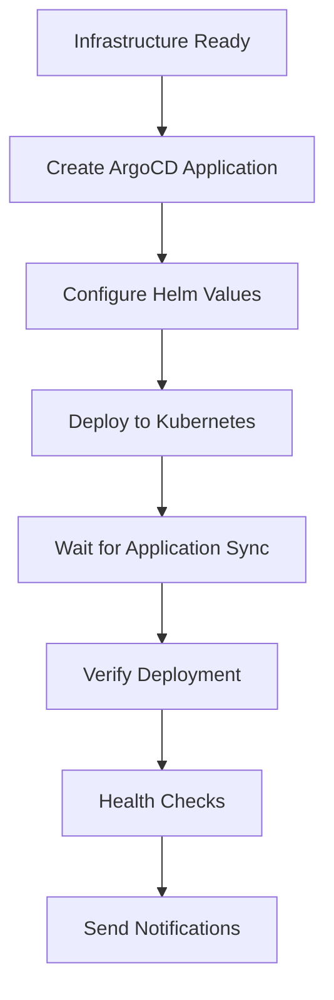

# MSDP Backstage GitHub Actions Workflows

This directory contains GitHub Actions workflows for deploying, managing, and testing the MSDP Backstage developer portal using Crossplane and ArgoCD.

## 🚀 Workflows Overview

### 1. Deploy Backstage (`deploy-backstage.yml`)

**Purpose**: Deploy Backstage infrastructure and application using Crossplane and ArgoCD

**Triggers**:
- Push to `main` or `develop` branches
- Pull requests to `main` branch
- Manual workflow dispatch

**Features**:
- ✅ **No hardcoded values** - All configuration via environment variables
- ✅ **Multi-environment support** - Dev, staging, prod
- ✅ **Multi-BU support** - Platform core, food delivery, grocery, cleaning, repair
- ✅ **Multi-country support** - UK, India, global
- ✅ **Infrastructure validation** - YAML linting and validation
- ✅ **Prerequisites check** - Crossplane, ArgoCD, kubectl
- ✅ **Secrets management** - Automatic secret creation
- ✅ **Infrastructure deployment** - Crossplane compositions
- ✅ **Application deployment** - ArgoCD applications
- ✅ **Health verification** - Pod, service, and ingress checks
- ✅ **Deployment notifications** - Success/failure notifications

**Usage**:
```bash
# Automatic deployment on push to main (prod) or develop (staging)
git push origin main

# Manual deployment with custom parameters
# Go to Actions tab → Deploy Backstage → Run workflow
```

**Parameters**:
- `environment`: dev, staging, prod
- `business_unit`: platform-core, food-delivery, grocery-delivery, cleaning-services, repair-services
- `country`: global, uk, india
- `dry_run`: true/false

### 2. Manage Secrets (`manage-secrets.yml`)

**Purpose**: Manage Backstage secrets and credentials

**Triggers**:
- Manual workflow dispatch only

**Features**:
- ✅ **Create secrets** - Generate new secrets for deployment
- ✅ **Update secrets** - Update existing secrets with new values
- ✅ **Rotate secrets** - Rotate sensitive secrets (passwords, tokens)
- ✅ **Validate secrets** - Verify all required secrets exist
- ✅ **Multi-environment** - Manage secrets per environment/BU/country
- ✅ **Secure storage** - Secrets stored in Kubernetes secrets

**Usage**:
```bash
# Go to Actions tab → Manage Backstage Secrets → Run workflow
```

**Actions**:
- `create-secrets`: Create new secrets for deployment
- `update-secrets`: Update existing secrets
- `rotate-secrets`: Rotate sensitive secrets
- `validate-secrets`: Validate secret existence and completeness

### 3. Test Backstage (`test-backstage.yml`)

**Purpose**: Comprehensive testing of Backstage deployment

**Triggers**:
- Manual workflow dispatch only

**Features**:
- ✅ **Health checks** - Pod, service, and ingress health
- ✅ **Smoke tests** - Basic functionality testing
- ✅ **Integration tests** - API and service integration
- ✅ **Load tests** - Performance and scalability testing
- ✅ **Security tests** - Security configuration validation
- ✅ **Multi-environment** - Test any environment/BU/country combination

**Usage**:
```bash
# Go to Actions tab → Test Backstage Deployment → Run workflow
```

**Test Types**:
- `health-check`: Verify pods, services, and ingress are healthy
- `smoke-test`: Test basic functionality and endpoints
- `integration-test`: Test API integration and service templates
- `load-test`: Performance testing with k6
- `security-test`: Security configuration validation

## 🔧 Required Secrets

### GitHub Repository Secrets

Add these secrets to your GitHub repository settings:

#### Azure Configuration
```bash
AZURE_CLIENT_ID=your-azure-client-id
AZURE_CLIENT_SECRET=your-azure-client-secret
AZURE_TENANT_ID=your-azure-tenant-id
AZURE_SUBSCRIPTION_ID=your-azure-subscription-id
AZURE_RESOURCE_GROUP=your-resource-group
AKS_CLUSTER_NAME=your-aks-cluster-name
```

#### Backstage Configuration
```bash
SESSION_SECRET=your-session-secret
GITHUB_INTEGRATION=your-github-integration-config
AZURE_INTEGRATION=your-azure-integration-config
ARGOCD_INTEGRATION=your-argocd-integration-config
ARGOCD_PASSWORD=your-argocd-password
```

#### Payment Providers
```bash
STRIPE_TOKEN=your-stripe-token
RAZORPAY_TOKEN=your-razorpay-token
PAYTM_TOKEN=your-paytm-token
```

#### Government APIs
```bash
HMRC_TOKEN=your-hmrc-token
FSSAI_TOKEN=your-fssai-token
GST_TOKEN=your-gst-token
```

## 🌍 Environment Configuration

### Environment Variables

The workflows automatically set environment variables based on the deployment parameters:

```yaml
# Environment-specific variables
ENVIRONMENT=dev|staging|prod
BUSINESS_UNIT=platform-core|food-delivery|grocery-delivery|cleaning-services|repair-services
COUNTRY=global|uk|india
NAMESPACE=backstage-{environment}
```

### Resource Naming

All resources are automatically named based on the deployment parameters:

```bash
# Crossplane Infrastructure
XBackstageInfrastructure: backstage-{env}-{bu}-{country}
Secret: backstage-{env}-{bu}-{country}-secrets

# ArgoCD Application
Application: backstage-{env}-{bu}-{country}

# Kubernetes Resources
Namespace: backstage-{env}
Service: backstage
Ingress: backstage-ingress
```

## 📋 Deployment Process

### 1. Infrastructure Deployment (Crossplane)



### 2. Application Deployment (ArgoCD)



## 🔍 Monitoring and Verification

### Health Checks

The deployment workflow includes comprehensive health checks:

1. **Crossplane Infrastructure**
   - XRD and Composition installation
   - Infrastructure claim status
   - Resource provisioning status

2. **ArgoCD Application**
   - Application sync status
   - Health status
   - Resource status

3. **Kubernetes Resources**
   - Pod health and readiness
   - Service endpoints
   - Ingress configuration
   - Resource utilization

### Testing

The test workflow provides multiple testing levels:

1. **Health Check**
   - Pod status verification
   - Service endpoint validation
   - Ingress accessibility

2. **Smoke Test**
   - Basic endpoint accessibility
   - Service functionality
   - API responsiveness

3. **Integration Test**
   - API integration testing
   - Service template validation
   - Cross-service communication

4. **Load Test**
   - Performance testing with k6
   - Response time validation
   - Error rate monitoring

5. **Security Test**
   - Pod security context validation
   - Network policy verification
   - RBAC configuration check
   - Secret management validation

## 🚨 Troubleshooting

### Common Issues

1. **Infrastructure Not Ready**
   ```bash
   # Check Crossplane status
   kubectl get xbackstageinfrastructure -n crossplane-system
   kubectl describe xbackstageinfrastructure <name> -n crossplane-system
   ```

2. **Application Not Synced**
   ```bash
   # Check ArgoCD status
   kubectl get application -n argocd
   kubectl describe application <name> -n argocd
   ```

3. **Pods Not Running**
   ```bash
   # Check pod status
   kubectl get pods -n backstage-<environment>
   kubectl logs <pod-name> -n backstage-<environment>
   ```

4. **Secrets Missing**
   ```bash
   # Check secrets
   kubectl get secrets -n crossplane-system
   kubectl describe secret <secret-name> -n crossplane-system
   ```

### Debug Mode

Enable debug mode by setting the `ACTIONS_STEP_DEBUG` secret to `true`:

```bash
# In GitHub repository settings
ACTIONS_STEP_DEBUG=true
```

### Logs

Access workflow logs:
1. Go to Actions tab in GitHub
2. Click on the workflow run
3. Click on the job
4. Click on the step to see logs

## 🔄 CI/CD Integration

### Branch Strategy

- **`main`** → Production deployment
- **`develop`** → Staging deployment
- **Feature branches** → Development deployment (manual)

### Pull Request Workflow

1. Create feature branch
2. Make changes
3. Create pull request
4. Workflow validates configuration
5. Merge to `develop` for staging deployment
6. Merge to `main` for production deployment

### Manual Deployment

Use workflow dispatch for:
- Custom environment/BU/country combinations
- Emergency deployments
- Testing specific configurations
- Dry run validation

## 📚 Additional Resources

- [GitHub Actions Documentation](https://docs.github.com/en/actions)
- [Crossplane Documentation](https://crossplane.io/docs/)
- [ArgoCD Documentation](https://argo-cd.readthedocs.io/)
- [Kubernetes Documentation](https://kubernetes.io/docs/)

## 🤝 Contributing

1. Fork the repository
2. Create a feature branch
3. Make your changes
4. Test the workflows
5. Submit a pull request

## 📄 License

This project is licensed under the MIT License - see the LICENSE file for details.
