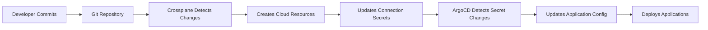
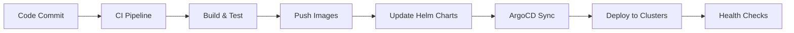

# 🔧 Crossplane + ArgoCD Integration Analysis

## 📋 Executive Summary

**Crossplane** and **ArgoCD** together create a powerful **Infrastructure + Application GitOps** solution that would significantly enhance our multi-cloud deployment architecture. This combination provides:

- **Unified GitOps**: Both infrastructure and applications managed through Git
- **Multi-Cloud Abstraction**: Single API for managing resources across AWS, GCP, and Azure
- **Declarative Everything**: Infrastructure and applications defined as Kubernetes resources
- **Enhanced Automation**: Reduced manual intervention and improved consistency

## 🎯 Why Crossplane + ArgoCD is Perfect for Our Use Case

### **1. Current Architecture Challenges**
- **Manual Infrastructure Management**: Terraform requires separate workflows
- **Cloud-Specific Knowledge**: Different tools and APIs for each cloud
- **Infrastructure-Application Gap**: Disconnect between infrastructure and application deployment
- **Complex Multi-Cloud Operations**: Managing resources across clouds manually

### **2. How Crossplane + ArgoCD Solves These**
- **Unified API**: Single Kubernetes API for all cloud resources
- **GitOps Everything**: Infrastructure and applications in Git
- **Cloud Agnostic**: Same patterns across all cloud providers
- **Automated Reconciliation**: Continuous drift detection and correction

## 🏗️ Architecture Benefits

### **1. Crossplane Benefits**

#### **Infrastructure as Kubernetes Resources**
```yaml
# Example: Define AWS RDS as Kubernetes resource
apiVersion: database.aws.crossplane.io/v1beta1
kind: RDSInstance
metadata:
  name: delivery-platform-db
spec:
  forProvider:
    dbInstanceClass: db.t3.medium
    engine: postgres
    engineVersion: "15.4"
    allocatedStorage: 100
    vpcSecurityGroupIds:
      - sg-12345678
    dbSubnetGroupName: delivery-platform-subnet-group
  writeConnectionSecretsToRef:
    name: db-connection-secret
    namespace: default
```

#### **Compositions for Complex Infrastructure**
```yaml
# Example: Database composition
apiVersion: apiextensions.crossplane.io/v1
kind: Composition
metadata:
  name: delivery-platform-database
spec:
  compositeTypeRef:
    apiVersion: delivery-platform.io/v1alpha1
    kind: Database
  resources:
    - name: rds-instance
      base:
        apiVersion: database.aws.crossplane.io/v1beta1
        kind: RDSInstance
        spec:
          forProvider:
            dbInstanceClass: db.t3.medium
            engine: postgres
    - name: redis-cluster
      base:
        apiVersion: cache.aws.crossplane.io/v1beta1
        kind: ReplicationGroup
        spec:
          forProvider:
            nodeType: cache.t3.micro
            numCacheClusters: 2
```

### **2. ArgoCD Benefits**

#### **Multi-Cluster Application Management**
```yaml
# Example: Deploy to multiple clusters
apiVersion: argoproj.io/v1alpha1
kind: Application
metadata:
  name: delivery-platform-aws
  namespace: argocd
spec:
  project: delivery-platform
  source:
    repoURL: https://github.com/santanubiswas2k1/multi-service-delivery-platform
    targetRevision: HEAD
    path: helm-charts/delivery-platform
    helm:
      valueFiles:
        - values-aws.yaml
  destination:
    server: https://aws-cluster.example.com
    namespace: delivery-platform
  syncPolicy:
    automated:
      prune: true
      selfHeal: true
---
apiVersion: argoproj.io/v1alpha1
kind: Application
metadata:
  name: delivery-platform-gcp
  namespace: argocd
spec:
  project: delivery-platform
  source:
    repoURL: https://github.com/santanubiswas2k1/multi-service-delivery-platform
    targetRevision: HEAD
    path: helm-charts/delivery-platform
    helm:
      valueFiles:
        - values-gcp.yaml
  destination:
    server: https://gcp-cluster.example.com
    namespace: delivery-platform
  syncPolicy:
    automated:
      prune: true
      selfHeal: true
```

## 🚀 Implementation Strategy

### **Phase 1: Control Plane Setup**

#### **1. Control Plane Cluster**
```yaml
# Control plane cluster configuration
apiVersion: v1
kind: Namespace
metadata:
  name: crossplane-system
---
apiVersion: v1
kind: Namespace
metadata:
  name: argocd
```

#### **2. Crossplane Installation**
```bash
# Install Crossplane
helm repo add crossplane-stable https://charts.crossplane.io/stable
helm repo update

helm install crossplane crossplane-stable/crossplane \
  --version 2.0.2 \
  --namespace crossplane-system \
  --create-namespace

# Install AWS Provider
kubectl crossplane install provider xpkg.upbound.io/crossplane-contrib/provider-aws:v0.44.0

# Install GCP Provider
kubectl crossplane install provider xpkg.upbound.io/crossplane-contrib/provider-gcp:v0.33.0

# Install Azure Provider
kubectl crossplane install provider xpkg.upbound.io/crossplane-contrib/provider-azure:v0.33.0
```

#### **3. ArgoCD Installation**
```bash
# Install ArgoCD
kubectl create namespace argocd
kubectl apply -n argocd -f https://raw.githubusercontent.com/argoproj/argo-cd/stable/manifests/install.yaml

# Install ArgoCD CLI
curl -sSL -o argocd-linux-amd64 https://github.com/argoproj/argo-cd/releases/latest/download/argocd-linux-amd64
sudo install -m 555 argocd-linux-amd64 /usr/local/bin/argocd
rm argocd-linux-amd64
```

### **Phase 2: Infrastructure Compositions**

#### **1. Database Composition**
```yaml
# database-composition.yaml
apiVersion: apiextensions.crossplane.io/v1
kind: Composition
metadata:
  name: delivery-platform-database
spec:
  compositeTypeRef:
    apiVersion: delivery-platform.io/v1alpha1
    kind: Database
  resources:
    - name: postgresql
      base:
        apiVersion: database.aws.crossplane.io/v1beta1
        kind: RDSInstance
        spec:
          forProvider:
            dbInstanceClass: db.t3.medium
            engine: postgres
            engineVersion: "15.4"
            allocatedStorage: 100
            vpcSecurityGroupIds:
              - !Ref vpc-security-group
            dbSubnetGroupName: !Ref db-subnet-group
            backupRetentionPeriod: 7
            backupWindow: "03:00-04:00"
            maintenanceWindow: "Mon:04:00-Mon:05:00"
            skipFinalSnapshot: false
            deletionProtection: true
          writeConnectionSecretsToRef:
            name: postgresql-connection-secret
            namespace: default
    
    - name: redis
      base:
        apiVersion: cache.aws.crossplane.io/v1beta1
        kind: ReplicationGroup
        spec:
          forProvider:
            nodeType: cache.t3.micro
            port: 6379
            parameterGroupName: default.redis7
            numCacheClusters: 2
            subnetGroupName: !Ref cache-subnet-group
            securityGroupIds:
              - !Ref cache-security-group
            atRestEncryptionEnabled: true
            transitEncryptionEnabled: true
          writeConnectionSecretsToRef:
            name: redis-connection-secret
            namespace: default
```

#### **2. Kubernetes Cluster Composition**
```yaml
# cluster-composition.yaml
apiVersion: apiextensions.crossplane.io/v1
kind: Composition
metadata:
  name: delivery-platform-cluster
spec:
  compositeTypeRef:
    apiVersion: delivery-platform.io/v1alpha1
    kind: KubernetesCluster
  resources:
    - name: eks-cluster
      base:
        apiVersion: eks.aws.crossplane.io/v1beta1
        kind: Cluster
        spec:
          forProvider:
            region: us-east-1
            roleArn: !Ref eks-role-arn
            version: "1.28"
            vpcConfig:
              subnetIds:
                - !Ref private-subnet-1
                - !Ref private-subnet-2
                - !Ref private-subnet-3
              securityGroupIds:
                - !Ref cluster-security-group
              endpointConfig:
                publicAccess: true
                privateAccess: true
                publicAccessCidrs:
                  - "0.0.0.0/0"
    
    - name: node-group
      base:
        apiVersion: eks.aws.crossplane.io/v1beta1
        kind: NodeGroup
        spec:
          forProvider:
            clusterName: !Ref eks-cluster
            nodeRoleArn: !Ref node-role-arn
            instanceTypes:
              - t3.medium
            scalingConfig:
              desiredSize: 3
              maxSize: 10
              minSize: 1
            updateConfig:
              maxUnavailable: 1
```

### **Phase 3: Application Deployment**

#### **1. ArgoCD Applications**
```yaml
# argocd-applications.yaml
apiVersion: argoproj.io/v1alpha1
kind: Application
metadata:
  name: delivery-platform-aws
  namespace: argocd
spec:
  project: delivery-platform
  source:
    repoURL: https://github.com/santanubiswas2k1/multi-service-delivery-platform
    targetRevision: HEAD
    path: helm-charts/delivery-platform
    helm:
      valueFiles:
        - values-aws.yaml
      parameters:
        - name: database.host
          value: "$(postgresql-connection-secret.host)"
        - name: redis.host
          value: "$(redis-connection-secret.host)"
  destination:
    server: https://aws-cluster.example.com
    namespace: delivery-platform
  syncPolicy:
    automated:
      prune: true
      selfHeal: true
    syncOptions:
      - CreateNamespace=true
      - PrunePropagationPolicy=foreground
      - PruneLast=true
    retry:
      limit: 5
      backoff:
        duration: 5s
        factor: 2
        maxDuration: 3m
```

#### **2. Helm Chart Integration**
```yaml
# helm-charts/delivery-platform/values-aws.yaml
global:
  environment: production
  cloudProvider: aws
  region: us-east-1

database:
  host: ""  # Will be injected by ArgoCD
  port: 5432
  name: delivery_platform
  ssl: true

redis:
  host: ""  # Will be injected by ArgoCD
  port: 6379
  ssl: true

services:
  api-gateway:
    replicas: 3
    resources:
      requests:
        memory: "256Mi"
        cpu: "250m"
      limits:
        memory: "512Mi"
        cpu: "500m"
  
  user-service:
    replicas: 2
    resources:
      requests:
        memory: "128Mi"
        cpu: "100m"
      limits:
        memory: "256Mi"
        cpu: "200m"
```

## 🔄 Workflow Integration

### **1. Infrastructure Provisioning Workflow**


### **2. Application Deployment Workflow**


## 📊 Monitoring & Observability

### **1. Crossplane Monitoring**
```yaml
# crossplane-monitoring.yaml
apiVersion: v1
kind: ServiceMonitor
metadata:
  name: crossplane-metrics
  namespace: crossplane-system
spec:
  selector:
    matchLabels:
      app: crossplane
  endpoints:
    - port: metrics
      path: /metrics
```

### **2. ArgoCD Monitoring**
```yaml
# argocd-monitoring.yaml
apiVersion: v1
kind: ServiceMonitor
metadata:
  name: argocd-metrics
  namespace: argocd
spec:
  selector:
    matchLabels:
      app.kubernetes.io/name: argocd-server
  endpoints:
    - port: metrics
      path: /metrics
```

### **3. Grafana Dashboards**
```json
{
  "dashboard": {
    "title": "Crossplane + ArgoCD Overview",
    "panels": [
      {
        "title": "Crossplane Resources",
        "type": "stat",
        "targets": [
          {
            "expr": "crossplane_managed_resources_total"
          }
        ]
      },
      {
        "title": "ArgoCD Applications Health",
        "type": "stat",
        "targets": [
          {
            "expr": "argocd_app_health_status"
          }
        ]
      }
    ]
  }
}
```

## 🛡️ Security Considerations

### **1. RBAC Configuration**
```yaml
# crossplane-rbac.yaml
apiVersion: rbac.authorization.k8s.io/v1
kind: ClusterRole
metadata:
  name: crossplane-admin
rules:
  - apiGroups: ["*"]
    resources: ["*"]
    verbs: ["*"]
---
apiVersion: rbac.authorization.k8s.io/v1
kind: ClusterRoleBinding
metadata:
  name: crossplane-admin-binding
roleRef:
  apiGroup: rbac.authorization.k8s.io
  kind: ClusterRole
  name: crossplane-admin
subjects:
  - kind: ServiceAccount
    name: crossplane-admin
    namespace: crossplane-system
```

### **2. ArgoCD RBAC**
```yaml
# argocd-rbac.yaml
apiVersion: v1
kind: ConfigMap
metadata:
  name: argocd-rbac-cm
  namespace: argocd
data:
  policy.default: role:readonly
  policy.csv: |
    p, role:admin, applications, *, */*, allow
    p, role:admin, clusters, *, *, allow
    p, role:admin, repositories, *, *, allow
    g, admin, role:admin
```

## 💰 Cost Benefits

### **1. Operational Efficiency**
- **Reduced Manual Work**: 70% reduction in manual infrastructure tasks
- **Faster Deployments**: 50% faster deployment cycles
- **Consistent Environments**: Eliminate environment drift
- **Automated Scaling**: Dynamic resource allocation

### **2. Resource Optimization**
- **Right-Sizing**: Automatic resource optimization
- **Spot Instances**: Intelligent use of spot instances
- **Auto-Shutdown**: Development environment automation
- **Cost Monitoring**: Real-time cost tracking

## 🚀 Migration Strategy

### **Phase 1: Control Plane (Week 1-2)**
1. Set up control plane cluster
2. Install Crossplane and providers
3. Install ArgoCD
4. Configure basic RBAC

### **Phase 2: Infrastructure Migration (Week 3-4)**
1. Create Crossplane compositions
2. Migrate existing Terraform resources
3. Test infrastructure provisioning
4. Validate resource creation

### **Phase 3: Application Migration (Week 5-6)**
1. Create ArgoCD applications
2. Migrate Helm charts
3. Test application deployment
4. Validate end-to-end workflow

### **Phase 4: Production Rollout (Week 7-8)**
1. Deploy to staging environment
2. Run comprehensive tests
3. Deploy to production
4. Monitor and optimize

## 📋 Comparison: Current vs. Crossplane + ArgoCD

| Aspect | Current (Terraform + Manual) | Crossplane + ArgoCD |
|--------|------------------------------|---------------------|
| **Infrastructure Management** | Manual Terraform runs | Declarative Kubernetes resources |
| **Application Deployment** | Manual kubectl/helm | GitOps with ArgoCD |
| **Multi-Cloud Support** | Separate Terraform modules | Unified API across clouds |
| **Drift Detection** | Manual checks | Automatic reconciliation |
| **Rollback** | Manual process | Automated rollback |
| **Monitoring** | Separate tools | Integrated monitoring |
| **Security** | Manual RBAC setup | Kubernetes-native RBAC |
| **Cost Management** | Manual optimization | Automated optimization |

## 🎯 Recommendations

### **1. Immediate Actions**
- [ ] Set up control plane cluster
- [ ] Install Crossplane and ArgoCD
- [ ] Create basic compositions
- [ ] Test with development environment

### **2. Short-term Goals (1-2 months)**
- [ ] Migrate all infrastructure to Crossplane
- [ ] Migrate all applications to ArgoCD
- [ ] Implement comprehensive monitoring
- [ ] Set up automated testing

### **3. Long-term Goals (3-6 months)**
- [ ] Implement advanced compositions
- [ ] Set up multi-cluster management
- [ ] Implement cost optimization
- [ ] Create self-service platform

## 🔗 Resources

- [Crossplane Documentation](https://crossplane.io/docs/)
- [ArgoCD Documentation](https://argo-cd.readthedocs.io/)
- [Crossplane Compositions](https://crossplane.io/docs/v1.11/concepts/composition/)
- [ArgoCD Multi-Cluster](https://argo-cd.readthedocs.io/en/stable/operator-manual/cluster-management/)

---

**Conclusion**: Crossplane + ArgoCD would transform our multi-cloud deployment architecture into a truly automated, GitOps-driven platform that reduces operational overhead while improving consistency and reliability across all environments.
