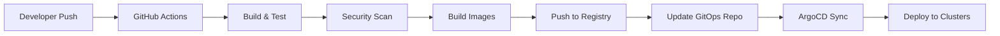

# 🌐 Multi-Cloud Deployment Architecture

## 📋 Overview

This document outlines a robust, fully automated multi-cloud deployment architecture for the Multi-Service Delivery Platform. The architecture enables seamless deployment across AWS, Google Cloud Platform (GCP), and Microsoft Azure with complete automation, high availability, and disaster recovery capabilities.

## 🎯 Architecture Principles

### **1. Cloud-Native Design**
- **Kubernetes-First**: All deployments use managed Kubernetes services (EKS, GKE, AKS)
- **Container-Based**: Microservices deployed as containers with Docker
- **Serverless Integration**: Hybrid approach with serverless functions for specific workloads
- **API-Driven**: All infrastructure managed through APIs and Infrastructure as Code

### **2. Multi-Cloud Strategy**
- **Vendor Independence**: Avoid vendor lock-in with cloud-agnostic tools
- **Geographic Distribution**: Deploy across multiple regions for global reach
- **Disaster Recovery**: Cross-cloud backup and failover capabilities
- **Cost Optimization**: Leverage best pricing across cloud providers

### **3. Automation & DevOps**
- **GitOps Workflow**: Declarative infrastructure and application management
- **Infrastructure as Code**: Terraform for infrastructure, Helm for applications
- **Continuous Deployment**: Automated testing, building, and deployment
- **Self-Healing**: Automatic recovery from failures

## 🏗️ Architecture Components

### **1. CI/CD Pipeline**

#### **GitHub Actions Workflow**
```yaml
# .github/workflows/multi-cloud-deploy.yml
name: Multi-Cloud Deployment
on:
  push:
    branches: [main, develop]
  pull_request:
    branches: [main]

jobs:
  build-and-test:
    runs-on: ubuntu-latest
    steps:
      - name: Checkout code
      - name: Run tests
      - name: Build Docker images
      - name: Security scanning
      - name: Push to registries

  deploy-aws:
    needs: build-and-test
    runs-on: ubuntu-latest
    steps:
      - name: Deploy to AWS EKS
      - name: Run smoke tests
      - name: Update monitoring

  deploy-gcp:
    needs: build-and-test
    runs-on: ubuntu-latest
    steps:
      - name: Deploy to GCP GKE
      - name: Run smoke tests
      - name: Update monitoring

  deploy-azure:
    needs: build-and-test
    runs-on: ubuntu-latest
    steps:
      - name: Deploy to Azure AKS
      - name: Run smoke tests
      - name: Update monitoring
```

#### **Container Registry Strategy**
- **Multi-Cloud Registry**: Harbor or AWS ECR Public
- **Image Signing**: Cosign for image integrity
- **Vulnerability Scanning**: Trivy integration
- **Multi-Architecture**: Support for ARM64 and AMD64

### **2. Infrastructure as Code**

#### **Terraform Modules**
```
infrastructure/
├── terraform/
│   ├── modules/
│   │   ├── aws/
│   │   │   ├── eks/
│   │   │   ├── rds/
│   │   │   ├── elasticsearch/
│   │   │   └── networking/
│   │   ├── gcp/
│   │   │   ├── gke/
│   │   │   ├── cloud-sql/
│   │   │   ├── elasticsearch/
│   │   │   └── networking/
│   │   └── azure/
│   │       ├── aks/
│   │       ├── postgresql/
│   │       ├── elasticsearch/
│   │       └── networking/
│   ├── environments/
│   │   ├── development/
│   │   ├── staging/
│   │   └── production/
│   └── global/
│       ├── dns/
│       ├── monitoring/
│       └── security/
```

#### **Helm Charts**
```
helm-charts/
├── delivery-platform/
│   ├── Chart.yaml
│   ├── values.yaml
│   ├── values-aws.yaml
│   ├── values-gcp.yaml
│   ├── values-azure.yaml
│   └── templates/
│       ├── api-gateway/
│       ├── user-service/
│       ├── order-service/
│       ├── payment-service/
│       └── delivery-service/
```

### **3. Cloud Provider Configurations**

#### **AWS Configuration**
```hcl
# terraform/modules/aws/eks/main.tf
module "eks" {
  source = "terraform-aws-modules/eks/aws"
  
  cluster_name    = var.cluster_name
  cluster_version = "1.28"
  
  vpc_id     = var.vpc_id
  subnet_ids = var.subnet_ids
  
  node_groups = {
    main = {
      desired_capacity = 3
      max_capacity     = 10
      min_capacity     = 1
      
      instance_types = ["t3.medium"]
      
      k8s_labels = {
        Environment = var.environment
        NodeGroup   = "main"
      }
    }
  }
  
  tags = {
    Environment = var.environment
    Project     = "delivery-platform"
  }
}
```

#### **GCP Configuration**
```hcl
# terraform/modules/gcp/gke/main.tf
resource "google_container_cluster" "primary" {
  name     = var.cluster_name
  location = var.region
  
  remove_default_node_pool = true
  initial_node_count       = 1
  
  network    = var.network
  subnetwork = var.subnetwork
  
  master_auth {
    client_certificate_config {
      issue_client_certificate = false
    }
  }
}

resource "google_container_node_pool" "primary_nodes" {
  name       = "${var.cluster_name}-node-pool"
  location   = var.region
  cluster    = google_container_cluster.primary.name
  node_count = 3
  
  node_config {
    preemptible  = false
    machine_type = "e2-medium"
    
    oauth_scopes = [
      "https://www.googleapis.com/auth/logging.write",
      "https://www.googleapis.com/auth/monitoring",
    ]
    
    labels = {
      environment = var.environment
      project     = "delivery-platform"
    }
  }
}
```

#### **Azure Configuration**
```hcl
# terraform/modules/azure/aks/main.tf
resource "azurerm_kubernetes_cluster" "main" {
  name                = var.cluster_name
  location            = var.location
  resource_group_name = var.resource_group_name
  dns_prefix          = var.dns_prefix
  
  default_node_pool {
    name       = "default"
    node_count = 3
    vm_size    = "Standard_D2s_v3"
  }
  
  identity {
    type = "SystemAssigned"
  }
  
  tags = {
    Environment = var.environment
    Project     = "delivery-platform"
  }
}
```

### **4. GitOps Deployment**

#### **ArgoCD Configuration**
```yaml
# argocd/applications/delivery-platform.yaml
apiVersion: argoproj.io/v1alpha1
kind: Application
metadata:
  name: delivery-platform
  namespace: argocd
spec:
  project: default
  source:
    repoURL: https://github.com/santanubiswas2k1/multi-service-delivery-platform
    targetRevision: HEAD
    path: helm-charts/delivery-platform
    helm:
      valueFiles:
        - values-aws.yaml
  destination:
    server: https://kubernetes.default.svc
    namespace: delivery-platform
  syncPolicy:
    automated:
      prune: true
      selfHeal: true
    syncOptions:
      - CreateNamespace=true
```

#### **Flux Configuration**
```yaml
# flux/apps/delivery-platform.yaml
apiVersion: kustomize.toolkit.fluxcd.io/v1beta2
kind: Kustomization
metadata:
  name: delivery-platform
  namespace: flux-system
spec:
  interval: 1m
  path: "./clusters/production"
  prune: true
  sourceRef:
    kind: GitRepository
    name: delivery-platform
  validation: client
```

### **5. Monitoring & Observability**

#### **Prometheus Configuration**
```yaml
# monitoring/prometheus/prometheus.yml
global:
  scrape_interval: 15s
  evaluation_interval: 15s

rule_files:
  - "rules/*.yml"

scrape_configs:
  - job_name: 'kubernetes-pods'
    kubernetes_sd_configs:
      - role: pod
    relabel_configs:
      - source_labels: [__meta_kubernetes_pod_annotation_prometheus_io_scrape]
        action: keep
        regex: true
      - source_labels: [__meta_kubernetes_pod_annotation_prometheus_io_path]
        action: replace
        target_label: __metrics_path__
        regex: (.+)

  - job_name: 'kubernetes-nodes'
    kubernetes_sd_configs:
      - role: node
    relabel_configs:
      - action: labelmap
        regex: __meta_kubernetes_node_label_(.+)
```

#### **Grafana Dashboards**
```json
{
  "dashboard": {
    "title": "Multi-Cloud Delivery Platform",
    "panels": [
      {
        "title": "Request Rate",
        "type": "graph",
        "targets": [
          {
            "expr": "sum(rate(http_requests_total[5m])) by (service, cloud_provider)"
          }
        ]
      },
      {
        "title": "Error Rate",
        "type": "graph",
        "targets": [
          {
            "expr": "sum(rate(http_requests_total{status=~\"5..\"}[5m])) by (service, cloud_provider)"
          }
        ]
      }
    ]
  }
}
```

### **6. Security & Compliance**

#### **HashiCorp Vault Configuration**
```yaml
# vault/config/vault.hcl
storage "consul" {
  address = "consul:8500"
  path    = "vault/"
}

listener "tcp" {
  address     = "0.0.0.0:8200"
  tls_disable = 1
}

seal "awskms" {
  region     = "us-east-1"
  kms_key_id = "arn:aws:kms:us-east-1:123456789012:key/12345678-1234-1234-1234-123456789012"
}

ui = true
```

#### **Falco Security Rules**
```yaml
# security/falco/rules.yaml
- rule: Unauthorized Process in Container
  desc: Detect unauthorized processes running in containers
  condition: >
    spawned_process and
    container and
    not proc.name in (nginx, node, python, java, postgres, redis)
  output: >
    Unauthorized process in container (user=%user.name command=%proc.cmdline %container.info)
  priority: WARNING
  tags: [container, process]
```

## 🚀 Deployment Workflow

### **1. Development Workflow**


### **2. Production Deployment**
1. **Code Commit**: Developer pushes to main branch
2. **CI Pipeline**: GitHub Actions triggers build and test
3. **Security Scan**: Trivy scans for vulnerabilities
4. **Image Build**: Docker images built and signed
5. **Registry Push**: Images pushed to multi-cloud registry
6. **GitOps Update**: ArgoCD detects changes
7. **Multi-Cloud Deploy**: Simultaneous deployment to all clouds
8. **Health Checks**: Automated health verification
9. **Monitoring Update**: Metrics and alerts configured

### **3. Rollback Strategy**
- **Blue-Green Deployment**: Zero-downtime deployments
- **Canary Releases**: Gradual traffic shifting
- **Automated Rollback**: Health check failures trigger rollback
- **Cross-Cloud Failover**: Traffic routing to healthy regions

## 📊 Monitoring & Alerting

### **1. Key Metrics**
- **Application Metrics**: Request rate, response time, error rate
- **Infrastructure Metrics**: CPU, memory, disk, network
- **Business Metrics**: Orders per minute, revenue, user activity
- **Security Metrics**: Failed logins, suspicious activity

### **2. Alerting Rules**
```yaml
# monitoring/alertmanager/rules.yml
groups:
  - name: delivery-platform
    rules:
      - alert: HighErrorRate
        expr: sum(rate(http_requests_total{status=~"5.."}[5m])) by (service) > 0.1
        for: 2m
        labels:
          severity: critical
        annotations:
          summary: "High error rate detected"
          description: "Service {{ $labels.service }} has error rate above 10%"
      
      - alert: PodCrashLooping
        expr: rate(kube_pod_container_status_restarts_total[15m]) > 0
        for: 5m
        labels:
          severity: warning
        annotations:
          summary: "Pod is crash looping"
          description: "Pod {{ $labels.pod }} is restarting frequently"
```

### **3. Dashboard Strategy**
- **Executive Dashboard**: High-level business metrics
- **Operations Dashboard**: Technical metrics and alerts
- **Development Dashboard**: Application performance metrics
- **Security Dashboard**: Security events and compliance status

## 🔒 Security Architecture

### **1. Network Security**
- **VPC/Network Isolation**: Private subnets for all services
- **Security Groups**: Restrictive firewall rules
- **WAF Protection**: Web Application Firewall for API endpoints
- **DDoS Protection**: Cloud-native DDoS mitigation

### **2. Identity & Access Management**
- **RBAC**: Role-based access control in Kubernetes
- **Service Accounts**: Least privilege service accounts
- **OIDC Integration**: Single sign-on across clouds
- **Multi-Factor Authentication**: Required for all admin access

### **3. Data Protection**
- **Encryption at Rest**: All databases and storage encrypted
- **Encryption in Transit**: TLS 1.3 for all communications
- **Key Management**: Cloud-native key management services
- **Data Classification**: Automatic data classification and handling

### **4. Compliance**
- **SOC 2 Type II**: Security and availability controls
- **ISO 27001**: Information security management
- **GDPR**: Data protection and privacy compliance
- **PCI DSS**: Payment card industry compliance

## 💰 Cost Optimization

### **1. Resource Optimization**
- **Auto-scaling**: Horizontal and vertical pod autoscaling
- **Spot Instances**: Use spot instances for non-critical workloads
- **Reserved Instances**: Long-term commitments for predictable workloads
- **Right-sizing**: Regular review and optimization of resource allocation

### **2. Multi-Cloud Cost Management**
- **Cost Monitoring**: Real-time cost tracking across clouds
- **Budget Alerts**: Automated budget alerts and limits
- **Cost Allocation**: Detailed cost allocation by service and team
- **Optimization Recommendations**: Automated cost optimization suggestions

### **3. Serverless Integration**
- **Lambda Functions**: Event-driven processing
- **Cloud Functions**: Serverless compute for specific tasks
- **Azure Functions**: Serverless workloads on Azure
- **Cost Efficiency**: Pay-per-use pricing model

## 🔄 Disaster Recovery

### **1. Backup Strategy**
- **Database Backups**: Automated daily backups with point-in-time recovery
- **Application State**: Regular backup of application configurations
- **Infrastructure State**: Terraform state backup and versioning
- **Cross-Region Replication**: Data replicated across regions

### **2. Failover Procedures**
- **Automated Failover**: Health check failures trigger automatic failover
- **Manual Failover**: Controlled failover procedures for maintenance
- **Data Consistency**: Ensure data consistency during failover
- **Recovery Time Objective**: RTO of 15 minutes for critical services

### **3. Testing & Validation**
- **Chaos Engineering**: Regular chaos engineering tests
- **Disaster Recovery Drills**: Quarterly DR testing
- **Backup Validation**: Regular backup restoration testing
- **Performance Testing**: Load testing across all regions

## 📈 Scaling Strategy

### **1. Horizontal Scaling**
- **Kubernetes HPA**: Horizontal Pod Autoscaler based on metrics
- **Cluster Autoscaler**: Automatic node scaling based on demand
- **Multi-Region Scaling**: Scale across multiple regions
- **Load Balancing**: Intelligent traffic distribution

### **2. Vertical Scaling**
- **VPA**: Vertical Pod Autoscaler for resource optimization
- **Resource Limits**: Proper resource requests and limits
- **Performance Monitoring**: Continuous performance monitoring
- **Capacity Planning**: Proactive capacity planning

### **3. Global Scaling**
- **CDN Integration**: Global content delivery network
- **Edge Computing**: Edge locations for reduced latency
- **Data Locality**: Data stored close to users
- **Traffic Routing**: Intelligent traffic routing based on location

## 🛠️ Tools & Technologies

### **1. Infrastructure**
- **Terraform**: Infrastructure as Code
- **Kubernetes**: Container orchestration
- **Helm**: Package management
- **Docker**: Containerization

### **2. CI/CD**
- **GitHub Actions**: Continuous Integration/Deployment
- **ArgoCD**: GitOps continuous delivery
- **Flux**: GitOps toolkit
- **Tekton**: Cloud-native CI/CD

### **3. Monitoring**
- **Prometheus**: Metrics collection
- **Grafana**: Visualization and dashboards
- **Jaeger**: Distributed tracing
- **ELK Stack**: Logging and analysis

### **4. Security**
- **HashiCorp Vault**: Secrets management
- **Falco**: Runtime security
- **Trivy**: Vulnerability scanning
- **OPA**: Policy engine

## 📋 Implementation Roadmap

### **Phase 1: Foundation (Weeks 1-4)**
- [ ] Set up GitHub Actions CI/CD pipeline
- [ ] Configure Terraform modules for all clouds
- [ ] Deploy basic Kubernetes clusters
- [ ] Set up monitoring and logging

### **Phase 2: Core Services (Weeks 5-8)**
- [ ] Deploy core microservices
- [ ] Configure databases and caching
- [ ] Set up load balancers and DNS
- [ ] Implement basic security measures

### **Phase 3: Advanced Features (Weeks 9-12)**
- [ ] Implement GitOps with ArgoCD
- [ ] Set up comprehensive monitoring
- [ ] Configure disaster recovery
- [ ] Implement security scanning

### **Phase 4: Optimization (Weeks 13-16)**
- [ ] Performance optimization
- [ ] Cost optimization
- [ ] Security hardening
- [ ] Documentation and training

## 📚 References

- [Kubernetes Documentation](https://kubernetes.io/docs/)
- [Terraform Documentation](https://www.terraform.io/docs/)
- [ArgoCD Documentation](https://argo-cd.readthedocs.io/)
- [Prometheus Documentation](https://prometheus.io/docs/)
- [HashiCorp Vault Documentation](https://www.vaultproject.io/docs/)

---

*This document is part of the Multi-Service Delivery Platform architecture and should be reviewed and updated regularly as the system evolves.*
