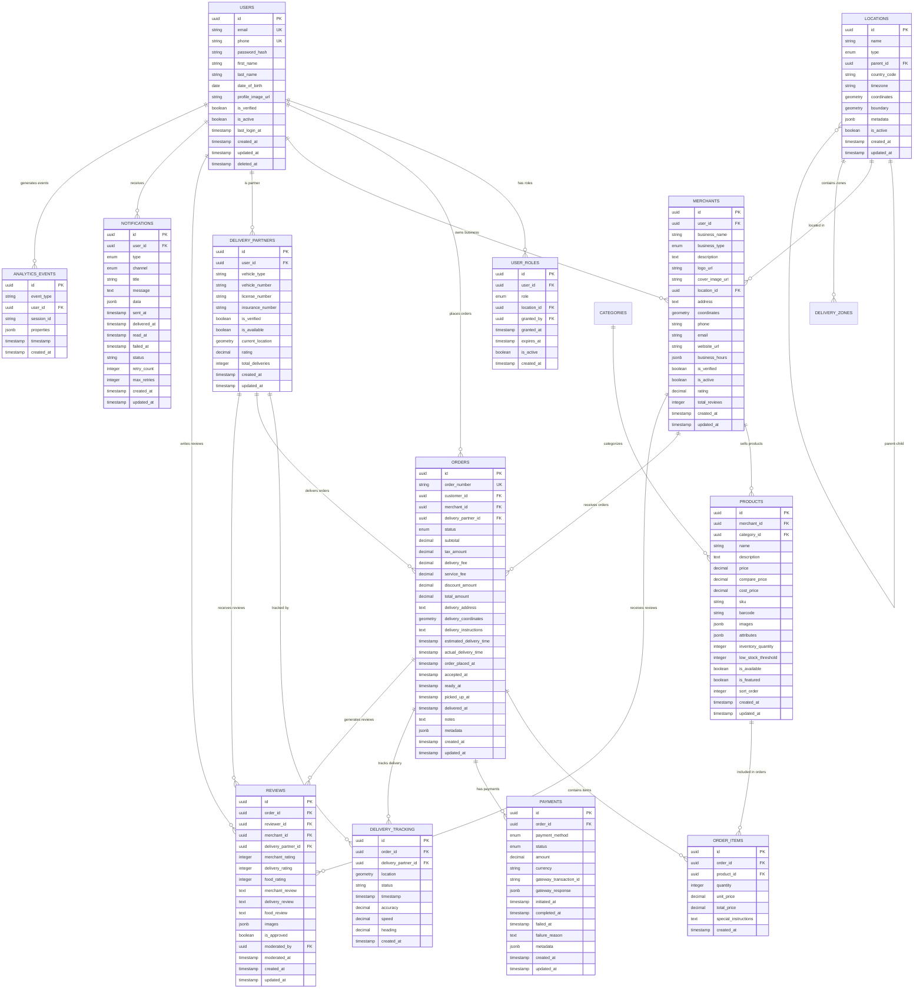

# Phase 4: Database Design - Multi-Service Delivery Platform

## 📋 **Document Overview**

This document provides comprehensive database design specifications for Phase 4 implementation of the multi-service delivery platform, featuring enterprise-scale PostgreSQL architecture with PostGIS support for geospatial operations.

**Version**: 4.0.0  
**Last Updated**: $(date)  
**Database**: PostgreSQL 15+ with PostGIS  
**Architecture**: Modular Microservices  
**Target Scale**: Enterprise (Global Multi-Region)

---

## 🏗️ **Database Architecture Overview**

### **Multi-Country Database Architecture**


### **Database Architecture Diagram**


### **Multi-Country Database Strategy**

#### **Global Database Architecture**
```yaml
multi_country_strategy:
  approach: "Country-Specific Databases with Global Sync"
  
  countries:
    united_states:
      regions: ["us-east-1", "us-west-2"]
      primary_db: "us-east-1"
      replicas: ["us-west-2"]
      data_residency: "US"
      compliance: ["SOX", "CCPA", "HIPAA"]
    
    india:
      regions: ["ap-south-1", "ap-southeast-1"]
      primary_db: "ap-south-1"
      replicas: ["ap-southeast-1"]
      data_residency: "India"
      compliance: ["IT Act 2000", "DPDP Act"]
    
    united_kingdom:
      regions: ["eu-west-2"]
      primary_db: "eu-west-2"
      replicas: []
      data_residency: "UK"
      compliance: ["GDPR", "UK GDPR"]
  
  global_services:
    analytics: "Cross-country aggregated data"
    monitoring: "Global system health"
    configuration: "Centralized config management"
    user_management: "Global user directory"
```

#### **Data Residency and Compliance**
```yaml
data_residency:
  user_data:
    storage: "Country of registration"
    processing: "Country of operation"
    backup: "Same country + encrypted cross-border"
  
  business_data:
    orders: "Country of merchant"
    payments: "Country of transaction"
    analytics: "Aggregated, anonymized"
  
  compliance_requirements:
    gdpr:
      - Right to erasure
      - Data portability
      - Consent management
      - Breach notification
    
    ccpa:
      - Right to know
      - Right to delete
      - Right to opt-out
      - Non-discrimination
    
    local_laws:
      - Data localization requirements
      - Cross-border data transfer restrictions
      - Government access protocols
```

#### **Cross-Country Data Synchronization**
```yaml
sync_strategy:
  real_time_sync:
    user_profiles: "Immediate sync for global access"
    system_config: "Immediate sync for consistency"
    global_analytics: "Near real-time aggregation"
  
  batch_sync:
    business_metrics: "Daily aggregation"
    compliance_reports: "Weekly sync"
    audit_logs: "Daily sync with encryption"
  
  conflict_resolution:
    user_data: "Last-write-wins with timestamp"
    business_data: "Country-specific rules"
    system_data: "Centralized authority"
```

### **Database Strategy**

#### **Primary Database (PostgreSQL)**
```yaml
database:
  type: PostgreSQL 15+
  purpose: Primary transactional database
  features:
    - ACID compliance
    - Complex queries and transactions
    - JSON/JSONB support
    - Full-text search
    - Geospatial operations (PostGIS)
    - Row-level security
    - Partitioning support
  
  configuration:
    max_connections: 200
    shared_buffers: 256MB
    effective_cache_size: 1GB
    maintenance_work_mem: 64MB
    checkpoint_completion_target: 0.9
    wal_buffers: 16MB
    default_statistics_target: 100
```

#### **Cache Layer (Redis)**
```yaml
redis:
  type: Redis 7+
  purpose: High-performance caching and session storage
  use_cases:
    - Session management
    - API response caching
    - Real-time data storage
    - Rate limiting
    - Pub/sub messaging
    - Temporary data storage
  
  configuration:
    maxmemory: 512mb
    maxmemory-policy: allkeys-lru
    save: "900 1 300 10 60 10000"
```

#### **Search Engine (Elasticsearch)**
```yaml
elasticsearch:
  type: Elasticsearch 8.8+
  purpose: Full-text search and analytics
  indices:
    - orders (order search and filtering)
    - products (product catalog search)
    - merchants (merchant discovery)
    - users (user search for admin)
    - analytics_events (business intelligence)
  
  configuration:
    cluster_name: delivery-platform
    node_name: node-1
    network_host: 0.0.0.0
    http_port: 9200
    discovery_type: single-node
```

---

## 🌍 **Multi-Country Database Implementation**

### **Country-Specific Database Configurations**

#### **United States Configuration**
```yaml
us_database_config:
  regions:
    primary: "us-east-1"
    secondary: "us-west-2"
  
  database_settings:
    timezone: "America/New_York"
    currency: "USD"
    language: "en-US"
    date_format: "MM/DD/YYYY"
  
  compliance:
    - SOX (Sarbanes-Oxley)
    - CCPA (California Consumer Privacy Act)
    - HIPAA (Health Insurance Portability)
    - PCI DSS Level 1
  
  data_retention:
    user_data: "7 years"
    transaction_data: "10 years"
    audit_logs: "7 years"
    analytics_data: "3 years"
  
  backup_strategy:
    frequency: "Every 6 hours"
    retention: "30 days"
    cross_region: "Yes (encrypted)"
    compliance_backup: "Separate encrypted storage"
```

#### **India Configuration**
```yaml
india_database_config:
  regions:
    primary: "ap-south-1"
    secondary: "ap-southeast-1"
  
  database_settings:
    timezone: "Asia/Kolkata"
    currency: "INR"
    language: "en-IN"
    date_format: "DD/MM/YYYY"
  
  compliance:
    - IT Act 2000
    - DPDP Act (Digital Personal Data Protection)
    - RBI Guidelines
    - Local State Regulations
  
  data_retention:
    user_data: "5 years"
    transaction_data: "7 years"
    audit_logs: "5 years"
    analytics_data: "2 years"
  
  backup_strategy:
    frequency: "Every 4 hours"
    retention: "90 days"
    cross_region: "Yes (within India)"
    compliance_backup: "Government-approved storage"
```

#### **United Kingdom Configuration**
```yaml
uk_database_config:
  regions:
    primary: "eu-west-2"
    secondary: "eu-west-1"
  
  database_settings:
    timezone: "Europe/London"
    currency: "GBP"
    language: "en-GB"
    date_format: "DD/MM/YYYY"
  
  compliance:
    - GDPR (General Data Protection Regulation)
    - UK GDPR
    - PECR (Privacy and Electronic Communications)
    - FCA Regulations
  
  data_retention:
    user_data: "6 years"
    transaction_data: "7 years"
    audit_logs: "6 years"
    analytics_data: "2 years"
  
  backup_strategy:
    frequency: "Every 4 hours"
    retention: "60 days"
    cross_region: "Yes (within EU)"
    compliance_backup: "GDPR-compliant storage"
```

### **Cross-Country Data Synchronization Implementation**

#### **Synchronization Tables**
```sql
-- Global user directory for cross-country access
CREATE TABLE global_users (
    id UUID PRIMARY KEY DEFAULT uuid_generate_v4(),
    global_user_id UUID UNIQUE NOT NULL,
    country_code VARCHAR(3) NOT NULL,
    local_user_id UUID NOT NULL,
    email VARCHAR(255) NOT NULL,
    phone VARCHAR(20),
    is_active BOOLEAN DEFAULT TRUE,
    last_sync_at TIMESTAMP WITH TIME ZONE DEFAULT NOW(),
    sync_status VARCHAR(20) DEFAULT 'synced',
    created_at TIMESTAMP WITH TIME ZONE DEFAULT NOW(),
    updated_at TIMESTAMP WITH TIME ZONE DEFAULT NOW()
);

-- Cross-country analytics aggregation
CREATE TABLE global_analytics (
    id UUID PRIMARY KEY DEFAULT uuid_generate_v4(),
    metric_name VARCHAR(100) NOT NULL,
    country_code VARCHAR(3) NOT NULL,
    metric_value DECIMAL(15,2) NOT NULL,
    metric_date DATE NOT NULL,
    aggregation_level VARCHAR(20) NOT NULL, -- daily, weekly, monthly
    created_at TIMESTAMP WITH TIME ZONE DEFAULT NOW(),
    UNIQUE(metric_name, country_code, metric_date, aggregation_level)
);

-- Global configuration management
CREATE TABLE global_config (
    id UUID PRIMARY KEY DEFAULT uuid_generate_v4(),
    config_key VARCHAR(100) UNIQUE NOT NULL,
    config_value JSONB NOT NULL,
    country_code VARCHAR(3), -- NULL for global configs
    is_active BOOLEAN DEFAULT TRUE,
    created_at TIMESTAMP WITH TIME ZONE DEFAULT NOW(),
    updated_at TIMESTAMP WITH TIME ZONE DEFAULT NOW()
);
```

#### **Synchronization Triggers**
```sql
-- Trigger to sync user changes globally
CREATE OR REPLACE FUNCTION sync_user_globally()
RETURNS TRIGGER AS $$
BEGIN
    -- Update global user directory
    INSERT INTO global_users (global_user_id, country_code, local_user_id, email, phone, is_active)
    VALUES (NEW.id, current_setting('app.country_code'), NEW.id, NEW.email, NEW.phone, NEW.is_active)
    ON CONFLICT (global_user_id) 
    DO UPDATE SET 
        email = EXCLUDED.email,
        phone = EXCLUDED.phone,
        is_active = EXCLUDED.is_active,
        last_sync_at = NOW(),
        sync_status = 'synced';
    
    RETURN NEW;
END;
$$ LANGUAGE plpgsql;

CREATE TRIGGER trigger_sync_user_globally
    AFTER INSERT OR UPDATE ON users
    FOR EACH ROW EXECUTE FUNCTION sync_user_globally();
```

### **Data Residency Implementation**

#### **Country-Specific Data Partitioning**
```sql
-- Partition orders by country
CREATE TABLE orders (
    -- ... existing columns ...
    country_code VARCHAR(3) NOT NULL,
    -- ... rest of columns ...
) PARTITION BY LIST (country_code);

-- Create country-specific partitions
CREATE TABLE orders_us PARTITION OF orders
    FOR VALUES IN ('USA');

CREATE TABLE orders_in PARTITION OF orders
    FOR VALUES IN ('IND');

CREATE TABLE orders_uk PARTITION OF orders
    FOR VALUES IN ('GBR');

-- Create indexes on partitioned tables
CREATE INDEX idx_orders_us_customer_id ON orders_us(customer_id);
CREATE INDEX idx_orders_in_customer_id ON orders_in(customer_id);
CREATE INDEX idx_orders_uk_customer_id ON orders_uk(customer_id);
```

#### **Data Localization Policies**
```sql
-- Row Level Security for data residency
CREATE POLICY data_residency_policy ON users
    FOR ALL TO authenticated_users
    USING (
        country_code = current_setting('app.country_code') OR
        current_user_role() IN ('global_admin', 'cross_country_support')
    );

-- Enable RLS on sensitive tables
ALTER TABLE users ENABLE ROW LEVEL SECURITY;
ALTER TABLE orders ENABLE ROW LEVEL SECURITY;
ALTER TABLE payments ENABLE ROW LEVEL SECURITY;
```

---

## 📊 **Data Model Design**

### **Core Entity Relationships**



### **Data Flow Diagram**


### **Entity Descriptions**

#### **1. User Management Entities**

##### **Users Table**
```sql
-- Core user authentication and profile information
CREATE TABLE users (
    id UUID PRIMARY KEY DEFAULT uuid_generate_v4(),
    email VARCHAR(255) UNIQUE NOT NULL,
    phone VARCHAR(20) UNIQUE,
    password_hash VARCHAR(255) NOT NULL,
    first_name VARCHAR(100) NOT NULL,
    last_name VARCHAR(100) NOT NULL,
    date_of_birth DATE,
    profile_image_url TEXT,
    is_verified BOOLEAN DEFAULT FALSE,
    is_active BOOLEAN DEFAULT TRUE,
    last_login_at TIMESTAMP WITH TIME ZONE,
    created_at TIMESTAMP WITH TIME ZONE DEFAULT NOW(),
    updated_at TIMESTAMP WITH TIME ZONE DEFAULT NOW(),
    deleted_at TIMESTAMP WITH TIME ZONE
);
```

**Purpose**: Central user authentication and profile management  
**Key Features**:
- UUID primary key for security
- Soft delete support
- Email and phone uniqueness
- Profile image support
- Verification status tracking

##### **User Roles Table**
```sql
-- Role-based access control (RBAC)
CREATE TABLE user_roles (
    id UUID PRIMARY KEY DEFAULT uuid_generate_v4(),
    user_id UUID NOT NULL REFERENCES users(id) ON DELETE CASCADE,
    role user_role_enum NOT NULL,
    location_id UUID, -- For location-specific roles
    granted_by UUID REFERENCES users(id),
    granted_at TIMESTAMP WITH TIME ZONE DEFAULT NOW(),
    expires_at TIMESTAMP WITH TIME ZONE,
    is_active BOOLEAN DEFAULT TRUE,
    created_at TIMESTAMP WITH TIME ZONE DEFAULT NOW()
);
```

**Purpose**: Flexible role assignment with location-based permissions  
**Key Features**:
- Multiple roles per user
- Location-specific role assignment
- Role expiration support
- Audit trail with grantor tracking

#### **2. Location Intelligence Entities**

##### **Locations Table**
```sql
-- Geographic hierarchy with PostGIS support
CREATE TABLE locations (
    id UUID PRIMARY KEY DEFAULT uuid_generate_v4(),
    name VARCHAR(255) NOT NULL,
    type location_type_enum NOT NULL,
    parent_id UUID REFERENCES locations(id),
    country_code VARCHAR(3),
    timezone VARCHAR(50),
    coordinates GEOMETRY(POINT, 4326), -- PostGIS geometry
    boundary GEOMETRY(POLYGON, 4326),  -- For service areas
    metadata JSONB,
    is_active BOOLEAN DEFAULT TRUE,
    created_at TIMESTAMP WITH TIME ZONE DEFAULT NOW(),
    updated_at TIMESTAMP WITH TIME ZONE DEFAULT NOW()
);
```

**Purpose**: Hierarchical geographic data with geospatial operations  
**Key Features**:
- PostGIS geometry support
- Hierarchical structure (country → state → district → municipality)
- Timezone information
- Flexible metadata storage
- Boundary definitions for service areas

##### **Delivery Zones Table**
```sql
-- Geofenced delivery areas
CREATE TABLE delivery_zones (
    id UUID PRIMARY KEY DEFAULT uuid_generate_v4(),
    name VARCHAR(255) NOT NULL,
    location_id UUID NOT NULL REFERENCES locations(id),
    zone_boundary GEOMETRY(POLYGON, 4326) NOT NULL,
    delivery_fee DECIMAL(10,2) DEFAULT 0,
    minimum_order_amount DECIMAL(10,2) DEFAULT 0,
    estimated_delivery_time INTEGER, -- in minutes
    is_active BOOLEAN DEFAULT TRUE,
    created_at TIMESTAMP WITH TIME ZONE DEFAULT NOW(),
    updated_at TIMESTAMP WITH TIME ZONE DEFAULT NOW()
);
```

**Purpose**: Geofenced delivery areas with pricing and timing  
**Key Features**:
- Polygon-based geofencing
- Dynamic pricing per zone
- Minimum order amounts
- Delivery time estimates

#### **3. Merchant Operations Entities**

##### **Merchants Table**
```sql
-- Business information and operations
CREATE TABLE merchants (
    id UUID PRIMARY KEY DEFAULT uuid_generate_v4(),
    user_id UUID NOT NULL REFERENCES users(id),
    business_name VARCHAR(255) NOT NULL,
    business_type business_type_enum NOT NULL,
    description TEXT,
    logo_url TEXT,
    cover_image_url TEXT,
    location_id UUID NOT NULL REFERENCES locations(id),
    address TEXT NOT NULL,
    coordinates GEOMETRY(POINT, 4326),
    phone VARCHAR(20),
    email VARCHAR(255),
    website_url TEXT,
    business_hours JSONB, -- Store operating hours
    is_verified BOOLEAN DEFAULT FALSE,
    is_active BOOLEAN DEFAULT TRUE,
    rating DECIMAL(3,2) DEFAULT 0,
    total_reviews INTEGER DEFAULT 0,
    created_at TIMESTAMP WITH TIME ZONE DEFAULT NOW(),
    updated_at TIMESTAMP WITH TIME ZONE DEFAULT NOW()
);
```

**Purpose**: Business profile and operational information  
**Key Features**:
- Business type categorization
- Geospatial location data
- Operating hours in JSON format
- Rating and review aggregation
- Verification status

##### **Products Table**
```sql
-- Product catalog management
CREATE TABLE products (
    id UUID PRIMARY KEY DEFAULT uuid_generate_v4(),
    merchant_id UUID NOT NULL REFERENCES merchants(id) ON DELETE CASCADE,
    category_id UUID REFERENCES categories(id),
    name VARCHAR(255) NOT NULL,
    description TEXT,
    price DECIMAL(10,2) NOT NULL,
    compare_price DECIMAL(10,2),
    cost_price DECIMAL(10,2),
    sku VARCHAR(100),
    barcode VARCHAR(100),
    images JSONB, -- Array of image URLs
    attributes JSONB, -- Product attributes like size, color, etc.
    inventory_quantity INTEGER DEFAULT 0,
    low_stock_threshold INTEGER DEFAULT 5,
    is_available BOOLEAN DEFAULT TRUE,
    is_featured BOOLEAN DEFAULT FALSE,
    sort_order INTEGER DEFAULT 0,
    created_at TIMESTAMP WITH TIME ZONE DEFAULT NOW(),
    updated_at TIMESTAMP WITH TIME ZONE DEFAULT NOW()
);
```

**Purpose**: Product catalog with inventory management  
**Key Features**:
- Flexible pricing (regular, compare, cost)
- Image gallery support
- Custom attributes in JSON
- Inventory tracking
- Low stock alerts
- Product ordering and featuring

#### **4. Order Management Entities**

##### **Orders Table**
```sql
-- Order lifecycle management
CREATE TABLE orders (
    id UUID PRIMARY KEY DEFAULT uuid_generate_v4(),
    order_number VARCHAR(50) UNIQUE NOT NULL,
    customer_id UUID NOT NULL REFERENCES users(id),
    merchant_id UUID NOT NULL REFERENCES merchants(id),
    delivery_partner_id UUID REFERENCES users(id),
    status order_status_enum DEFAULT 'pending',
    
    -- Order details
    subtotal DECIMAL(10,2) NOT NULL,
    tax_amount DECIMAL(10,2) DEFAULT 0,
    delivery_fee DECIMAL(10,2) DEFAULT 0,
    service_fee DECIMAL(10,2) DEFAULT 0,
    discount_amount DECIMAL(10,2) DEFAULT 0,
    total_amount DECIMAL(10,2) NOT NULL,
    
    -- Delivery information
    delivery_address TEXT NOT NULL,
    delivery_coordinates GEOMETRY(POINT, 4326),
    delivery_instructions TEXT,
    estimated_delivery_time TIMESTAMP WITH TIME ZONE,
    actual_delivery_time TIMESTAMP WITH TIME ZONE,
    
    -- Timestamps
    order_placed_at TIMESTAMP WITH TIME ZONE DEFAULT NOW(),
    accepted_at TIMESTAMP WITH TIME ZONE,
    ready_at TIMESTAMP WITH TIME ZONE,
    picked_up_at TIMESTAMP WITH TIME ZONE,
    delivered_at TIMESTAMP WITH TIME ZONE,
    
    -- Metadata
    notes TEXT,
    metadata JSONB,
    created_at TIMESTAMP WITH TIME ZONE DEFAULT NOW(),
    updated_at TIMESTAMP WITH TIME ZONE DEFAULT NOW()
);
```

**Purpose**: Complete order lifecycle tracking  
**Key Features**:
- Unique order numbering
- Detailed financial breakdown
- Geospatial delivery tracking
- Status-based timestamps
- Flexible metadata storage

##### **Order Items Table**
```sql
-- Individual order line items
CREATE TABLE order_items (
    id UUID PRIMARY KEY DEFAULT uuid_generate_v4(),
    order_id UUID NOT NULL REFERENCES orders(id) ON DELETE CASCADE,
    product_id UUID NOT NULL REFERENCES products(id),
    quantity INTEGER NOT NULL,
    unit_price DECIMAL(10,2) NOT NULL,
    total_price DECIMAL(10,2) NOT NULL,
    special_instructions TEXT,
    created_at TIMESTAMP WITH TIME ZONE DEFAULT NOW()
);
```

**Purpose**: Individual order line items with pricing  
**Key Features**:
- Product reference with pricing snapshot
- Quantity and pricing calculations
- Special instructions per item
- Cascade delete with orders

#### **5. Payment Processing Entities**

##### **Payments Table**
```sql
-- Payment transaction management
CREATE TABLE payments (
    id UUID PRIMARY KEY DEFAULT uuid_generate_v4(),
    order_id UUID NOT NULL REFERENCES orders(id),
    payment_method payment_method_enum NOT NULL,
    status payment_status_enum DEFAULT 'pending',
    amount DECIMAL(10,2) NOT NULL,
    currency VARCHAR(3) DEFAULT 'USD',
    
    -- Payment gateway information
    gateway_transaction_id VARCHAR(255),
    gateway_response JSONB,
    
    -- Timestamps
    initiated_at TIMESTAMP WITH TIME ZONE DEFAULT NOW(),
    completed_at TIMESTAMP WITH TIME ZONE,
    failed_at TIMESTAMP WITH TIME ZONE,
    
    -- Metadata
    failure_reason TEXT,
    metadata JSONB,
    created_at TIMESTAMP WITH TIME ZONE DEFAULT NOW(),
    updated_at TIMESTAMP WITH TIME ZONE DEFAULT NOW()
);
```

**Purpose**: Payment processing and transaction tracking  
**Key Features**:
- Multiple payment methods
- Gateway integration support
- Transaction status tracking
- Failure reason logging
- Gateway response storage

#### **6. Delivery Operations Entities**

##### **Delivery Partners Table**
```sql
-- Delivery partner information
CREATE TABLE delivery_partners (
    id UUID PRIMARY KEY DEFAULT uuid_generate_v4(),
    user_id UUID NOT NULL REFERENCES users(id),
    vehicle_type VARCHAR(50), -- bike, car, motorcycle, etc.
    vehicle_number VARCHAR(20),
    license_number VARCHAR(50),
    insurance_number VARCHAR(50),
    is_verified BOOLEAN DEFAULT FALSE,
    is_available BOOLEAN DEFAULT TRUE,
    current_location GEOMETRY(POINT, 4326),
    rating DECIMAL(3,2) DEFAULT 0,
    total_deliveries INTEGER DEFAULT 0,
    created_at TIMESTAMP WITH TIME ZONE DEFAULT NOW(),
    updated_at TIMESTAMP WITH TIME ZONE DEFAULT NOW()
);
```

**Purpose**: Delivery partner management and tracking  
**Key Features**:
- Vehicle information
- Verification status
- Real-time location tracking
- Performance metrics
- Availability status

##### **Delivery Tracking Table**
```sql
-- Real-time delivery tracking
CREATE TABLE delivery_tracking (
    id UUID PRIMARY KEY DEFAULT uuid_generate_v4(),
    order_id UUID NOT NULL REFERENCES orders(id),
    delivery_partner_id UUID NOT NULL REFERENCES delivery_partners(id),
    location GEOMETRY(POINT, 4326) NOT NULL,
    status VARCHAR(50) NOT NULL,
    timestamp TIMESTAMP WITH TIME ZONE DEFAULT NOW(),
    accuracy DECIMAL(8,2), -- GPS accuracy in meters
    speed DECIMAL(8,2),    -- Speed in km/h
    heading DECIMAL(8,2),  -- Direction in degrees
    created_at TIMESTAMP WITH TIME ZONE DEFAULT NOW()
);
```

**Purpose**: Real-time GPS tracking and delivery monitoring  
**Key Features**:
- High-frequency location updates
- GPS accuracy tracking
- Speed and direction data
- Status-based tracking
- Historical location data

#### **7. Review and Rating Entities**

##### **Reviews Table**
```sql
-- Customer reviews and ratings
CREATE TABLE reviews (
    id UUID PRIMARY KEY DEFAULT uuid_generate_v4(),
    order_id UUID NOT NULL REFERENCES orders(id),
    reviewer_id UUID NOT NULL REFERENCES users(id),
    merchant_id UUID NOT NULL REFERENCES merchants(id),
    delivery_partner_id UUID REFERENCES delivery_partners(id),
    
    -- Ratings (1-5 scale)
    merchant_rating INTEGER CHECK (merchant_rating >= 1 AND merchant_rating <= 5),
    delivery_rating INTEGER CHECK (delivery_rating >= 1 AND delivery_rating <= 5),
    food_rating INTEGER CHECK (food_rating >= 1 AND food_rating <= 5),
    
    -- Review content
    merchant_review TEXT,
    delivery_review TEXT,
    food_review TEXT,
    
    -- Images
    images JSONB,
    
    -- Moderation
    is_approved BOOLEAN DEFAULT FALSE,
    moderated_by UUID REFERENCES users(id),
    moderated_at TIMESTAMP WITH TIME ZONE,
    
    created_at TIMESTAMP WITH TIME ZONE DEFAULT NOW(),
    updated_at TIMESTAMP WITH TIME ZONE DEFAULT NOW()
);
```

**Purpose**: Multi-dimensional review system  
**Key Features**:
- Separate ratings for merchant, delivery, and food
- Text reviews for each dimension
- Image support
- Content moderation
- Order-based reviews

#### **8. Notification System Entities**

##### **Notifications Table**
```sql
-- Multi-channel notification system
CREATE TABLE notifications (
    id UUID PRIMARY KEY DEFAULT uuid_generate_v4(),
    user_id UUID NOT NULL REFERENCES users(id),
    type notification_type_enum NOT NULL,
    channel notification_channel_enum NOT NULL,
    title VARCHAR(255) NOT NULL,
    message TEXT NOT NULL,
    data JSONB, -- Additional data for the notification
    
    -- Delivery tracking
    sent_at TIMESTAMP WITH TIME ZONE,
    delivered_at TIMESTAMP WITH TIME ZONE,
    read_at TIMESTAMP WITH TIME ZONE,
    failed_at TIMESTAMP WITH TIME ZONE,
    
    -- Status
    status VARCHAR(20) DEFAULT 'pending', -- pending, sent, delivered, read, failed
    
    -- Retry logic
    retry_count INTEGER DEFAULT 0,
    max_retries INTEGER DEFAULT 3,
    
    created_at TIMESTAMP WITH TIME ZONE DEFAULT NOW(),
    updated_at TIMESTAMP WITH TIME ZONE DEFAULT NOW()
);
```

**Purpose**: Multi-channel notification delivery and tracking  
**Key Features**:
- Multiple notification types and channels
- Delivery status tracking
- Retry mechanism
- Rich data payload
- Read receipt tracking

#### **9. Analytics and Reporting Entities**

##### **Analytics Events Table**
```sql
-- Event tracking for business intelligence
CREATE TABLE analytics_events (
    id UUID PRIMARY KEY DEFAULT uuid_generate_v4(),
    event_type VARCHAR(100) NOT NULL,
    user_id UUID REFERENCES users(id),
    session_id VARCHAR(255),
    properties JSONB,
    timestamp TIMESTAMP WITH TIME ZONE DEFAULT NOW(),
    created_at TIMESTAMP WITH TIME ZONE DEFAULT NOW()
);
```

**Purpose**: Event tracking for business intelligence  
**Key Features**:
- Flexible event typing
- User and session tracking
- Rich property data
- High-volume event storage

---

## 🔧 **Database Extensions and Features**

### **Table Structure Overview**


### **PostgreSQL Extensions**

#### **Required Extensions**
```sql
-- UUID generation
CREATE EXTENSION IF NOT EXISTS "uuid-ossp";

-- Encryption functions
CREATE EXTENSION IF NOT EXISTS "pgcrypto";

-- Geospatial operations
CREATE EXTENSION IF NOT EXISTS "postgis";

-- Text search and similarity
CREATE EXTENSION IF NOT EXISTS "pg_trgm";

-- GIN index support
CREATE EXTENSION IF NOT EXISTS "btree_gin";
```

### **Custom Types and Enums**

#### **User Role Enum**
```sql
CREATE TYPE user_role_enum AS ENUM (
    'customer',
    'merchant',
    'delivery_partner',
    'admin',
    'super_admin',
    'support_staff',
    'country_distributor',
    'regional_manager',
    'district_manager',
    'municipal_manager'
);
```

#### **Location Type Enum**
```sql
CREATE TYPE location_type_enum AS ENUM (
    'country',
    'state',
    'district',
    'municipality',
    'service_area',
    'delivery_zone'
);
```

#### **Order Status Enum**
```sql
CREATE TYPE order_status_enum AS ENUM (
    'pending',
    'accepted',
    'preparing',
    'ready_for_pickup',
    'picked_up',
    'in_transit',
    'delivered',
    'cancelled',
    'refunded',
    'disputed'
);
```

---

## 📈 **Performance Optimization**

### **Indexing Strategy Diagram**


### **Indexing Strategy**

#### **Primary Indexes**
```sql
-- User indexes
CREATE INDEX idx_users_email ON users(email);
CREATE INDEX idx_users_phone ON users(phone);
CREATE INDEX idx_users_created_at ON users(created_at);

-- Location indexes
CREATE INDEX idx_locations_type ON locations(type);
CREATE INDEX idx_locations_parent_id ON locations(parent_id);
CREATE INDEX idx_locations_coordinates ON locations USING GIST(coordinates);
CREATE INDEX idx_delivery_zones_boundary ON delivery_zones USING GIST(zone_boundary);

-- Order indexes
CREATE INDEX idx_orders_customer_id ON orders(customer_id);
CREATE INDEX idx_orders_merchant_id ON orders(merchant_id);
CREATE INDEX idx_orders_status ON orders(status);
CREATE INDEX idx_orders_created_at ON orders(created_at);
CREATE INDEX idx_orders_delivery_coordinates ON orders USING GIST(delivery_coordinates);

-- Product indexes
CREATE INDEX idx_products_merchant_id ON products(merchant_id);
CREATE INDEX idx_products_category_id ON products(category_id);
CREATE INDEX idx_products_name ON products USING GIN(name gin_trgm_ops);

-- Delivery tracking indexes
CREATE INDEX idx_delivery_tracking_order_id ON delivery_tracking(order_id);
CREATE INDEX idx_delivery_tracking_timestamp ON delivery_tracking(timestamp);
CREATE INDEX idx_delivery_tracking_location ON delivery_tracking USING GIST(location);
```

#### **Composite Indexes**
```sql
-- Multi-column indexes for common queries
CREATE INDEX idx_orders_customer_status ON orders(customer_id, status);
CREATE INDEX idx_orders_merchant_status ON orders(merchant_id, status);
CREATE INDEX idx_orders_status_created ON orders(status, created_at);
CREATE INDEX idx_products_merchant_available ON products(merchant_id, is_available);
CREATE INDEX idx_delivery_tracking_order_timestamp ON delivery_tracking(order_id, timestamp);
```

### **Query Optimization**

#### **Common Query Patterns**
```sql
-- Active orders for a customer
SELECT o.*, m.business_name, dp.first_name || ' ' || dp.last_name as delivery_partner_name
FROM orders o
JOIN merchants m ON o.merchant_id = m.id
LEFT JOIN users dp ON o.delivery_partner_id = dp.id
WHERE o.customer_id = $1 
  AND o.status NOT IN ('delivered', 'cancelled', 'refunded')
ORDER BY o.created_at DESC;

-- Nearby merchants
SELECT m.*, ST_Distance(m.coordinates, ST_Point($1, $2)) as distance
FROM merchants m
WHERE ST_DWithin(m.coordinates, ST_Point($1, $2), $3)
  AND m.is_active = true
  AND m.is_verified = true
ORDER BY distance;

-- Delivery partner performance
SELECT 
    dp.id,
    dp.user_id,
    COUNT(o.id) as total_deliveries,
    AVG(EXTRACT(EPOCH FROM (o.delivered_at - o.picked_up_at))/60) as avg_delivery_time_minutes,
    AVG(r.delivery_rating) as avg_rating
FROM delivery_partners dp
LEFT JOIN orders o ON dp.user_id = o.delivery_partner_id AND o.status = 'delivered'
LEFT JOIN reviews r ON dp.user_id = r.delivery_partner_id
WHERE dp.is_active = true
GROUP BY dp.id, dp.user_id;
```

---

## 🔒 **Security and Compliance**

### **Security Architecture Diagram**


### **Row Level Security (RLS)**

#### **User Data Protection**
```sql
-- Enable RLS on sensitive tables
ALTER TABLE users ENABLE ROW LEVEL SECURITY;
ALTER TABLE user_sessions ENABLE ROW LEVEL SECURITY;
ALTER TABLE payments ENABLE ROW LEVEL SECURITY;

-- User access policy
CREATE POLICY user_access_policy ON users
    FOR ALL TO authenticated_users
    USING (id = current_user_id());

-- Admin access policy
CREATE POLICY admin_access_policy ON users
    FOR ALL TO admin_users
    USING (true);
```

### **Data Encryption**

#### **Sensitive Data Encryption**
```sql
-- Encrypt sensitive fields
CREATE OR REPLACE FUNCTION encrypt_sensitive_data(data TEXT)
RETURNS TEXT AS $$
BEGIN
    RETURN pgp_sym_encrypt(data, current_setting('app.encryption_key'));
END;
$$ LANGUAGE plpgsql;

-- Decrypt sensitive data
CREATE OR REPLACE FUNCTION decrypt_sensitive_data(encrypted_data TEXT)
RETURNS TEXT AS $$
BEGIN
    RETURN pgp_sym_decrypt(encrypted_data, current_setting('app.encryption_key'));
END;
$$ LANGUAGE plpgsql;
```

### **Audit Trail**

#### **Audit Trigger Function**
```sql
-- Audit trail function
CREATE OR REPLACE FUNCTION audit_trigger_function()
RETURNS TRIGGER AS $$
BEGIN
    INSERT INTO audit_log (
        table_name,
        operation,
        old_data,
        new_data,
        changed_by,
        changed_at
    ) VALUES (
        TG_TABLE_NAME,
        TG_OP,
        CASE WHEN TG_OP = 'DELETE' THEN row_to_json(OLD) ELSE NULL END,
        CASE WHEN TG_OP = 'INSERT' OR TG_OP = 'UPDATE' THEN row_to_json(NEW) ELSE NULL END,
        current_user,
        NOW()
    );
    RETURN COALESCE(NEW, OLD);
END;
$$ LANGUAGE plpgsql;

-- Apply audit triggers
CREATE TRIGGER users_audit_trigger
    AFTER INSERT OR UPDATE OR DELETE ON users
    FOR EACH ROW EXECUTE FUNCTION audit_trigger_function();
```

---

## 📊 **Data Views and Reporting**

### **Business Intelligence Views**

#### **Active Orders View**
```sql
CREATE VIEW active_orders AS
SELECT 
    o.*,
    u.first_name || ' ' || u.last_name as customer_name,
    u.phone as customer_phone,
    m.business_name as merchant_name,
    m.phone as merchant_phone,
    dp.first_name || ' ' || dp.last_name as delivery_partner_name,
    dp.phone as delivery_partner_phone,
    ST_AsText(o.delivery_coordinates) as delivery_location
FROM orders o
JOIN users u ON o.customer_id = u.id
JOIN merchants m ON o.merchant_id = m.id
LEFT JOIN users dp ON o.delivery_partner_id = dp.id
WHERE o.status NOT IN ('delivered', 'cancelled', 'refunded');
```

#### **Merchant Performance View**
```sql
CREATE VIEW merchant_performance AS
SELECT 
    m.id,
    m.business_name,
    m.business_type,
    m.location_id,
    COUNT(o.id) as total_orders,
    COUNT(CASE WHEN o.status = 'delivered' THEN 1 END) as completed_orders,
    COUNT(CASE WHEN o.status = 'cancelled' THEN 1 END) as cancelled_orders,
    AVG(r.merchant_rating) as avg_rating,
    SUM(CASE WHEN o.status = 'delivered' THEN o.total_amount ELSE 0 END) as total_revenue,
    AVG(CASE WHEN o.status = 'delivered' 
        THEN EXTRACT(EPOCH FROM (o.delivered_at - o.order_placed_at))/60 
        END) as avg_delivery_time_minutes
FROM merchants m
LEFT JOIN orders o ON m.id = o.merchant_id
LEFT JOIN reviews r ON m.id = r.merchant_id
GROUP BY m.id, m.business_name, m.business_type, m.location_id;
```

#### **Delivery Partner Performance View**
```sql
CREATE VIEW delivery_partner_performance AS
SELECT 
    dp.id,
    dp.user_id,
    u.first_name || ' ' || u.last_name as partner_name,
    dp.vehicle_type,
    dp.is_available,
    COUNT(o.id) as total_deliveries,
    COUNT(CASE WHEN o.status = 'delivered' THEN 1 END) as completed_deliveries,
    AVG(r.delivery_rating) as avg_rating,
    AVG(CASE WHEN o.status = 'delivered' 
        THEN EXTRACT(EPOCH FROM (o.delivered_at - o.picked_up_at))/60 
        END) as avg_delivery_time_minutes,
    SUM(CASE WHEN o.status = 'delivered' THEN o.delivery_fee ELSE 0 END) as total_earnings
FROM delivery_partners dp
JOIN users u ON dp.user_id = u.id
LEFT JOIN orders o ON dp.user_id = o.delivery_partner_id
LEFT JOIN reviews r ON dp.user_id = r.delivery_partner_id
GROUP BY dp.id, dp.user_id, u.first_name, u.last_name, dp.vehicle_type, dp.is_available;
```

---

## 🔄 **Data Migration and Versioning**

### **Migration Strategy**

#### **Database Versioning**
```sql
-- Migration tracking table
CREATE TABLE schema_migrations (
    version VARCHAR(255) PRIMARY KEY,
    applied_at TIMESTAMP WITH TIME ZONE DEFAULT NOW(),
    description TEXT
);

-- Insert initial migration
INSERT INTO schema_migrations (version, description) 
VALUES ('20240101000001', 'Initial schema creation');
```

#### **Data Seeding**

##### **Default Permissions**
```sql
-- Insert default permissions
INSERT INTO permissions (name, description, resource, action) VALUES
('user:read', 'Read user information', 'user', 'read'),
('user:write', 'Modify user information', 'user', 'write'),
('order:create', 'Create new orders', 'order', 'create'),
('order:read', 'Read order information', 'order', 'read'),
('order:update', 'Update order status', 'order', 'update'),
('merchant:manage', 'Manage merchant operations', 'merchant', 'manage'),
('delivery:assign', 'Assign delivery partners', 'delivery', 'assign'),
('analytics:read', 'Read analytics data', 'analytics', 'read'),
('admin:full', 'Full administrative access', 'admin', 'full');
```

##### **Default Categories**
```sql
-- Insert default product categories
INSERT INTO categories (name, description) VALUES
('Food & Beverage', 'Restaurants, cafes, and food delivery'),
('Grocery', 'Grocery stores and supermarkets'),
('Pharmacy', 'Pharmacies and health products'),
('Retail', 'General retail and shopping'),
('Services', 'Various service providers'),
('Beauty & Wellness', 'Beauty salons and wellness services'),
('Education', 'Educational services and tutoring'),
('Healthcare', 'Healthcare and medical services');
```

---

## 📈 **Monitoring and Maintenance**

### **Monitoring Architecture Diagram**


### **Database Monitoring**

#### **Performance Metrics**
```sql
-- Query performance monitoring
SELECT 
    query,
    calls,
    total_time,
    mean_time,
    rows
FROM pg_stat_statements
ORDER BY total_time DESC
LIMIT 10;

-- Table size monitoring
SELECT 
    schemaname,
    tablename,
    pg_size_pretty(pg_total_relation_size(schemaname||'.'||tablename)) as size
FROM pg_tables
WHERE schemaname = 'public'
ORDER BY pg_total_relation_size(schemaname||'.'||tablename) DESC;
```

#### **Index Usage Monitoring**
```sql
-- Index usage statistics
SELECT 
    schemaname,
    tablename,
    indexname,
    idx_tup_read,
    idx_tup_fetch
FROM pg_stat_user_indexes
ORDER BY idx_tup_read DESC;
```

### **Maintenance Tasks**

#### **Vacuum and Analyze**
```sql
-- Automated maintenance
CREATE OR REPLACE FUNCTION maintenance_routine()
RETURNS void AS $$
BEGIN
    -- Vacuum all tables
    VACUUM ANALYZE;
    
    -- Update statistics
    ANALYZE;
    
    -- Reindex if needed
    REINDEX DATABASE delivery_platform;
END;
$$ LANGUAGE plpgsql;
```

---

## 🚀 **Scalability Considerations**

### **Scalability Architecture Diagram**


### **Partitioning Strategy**

#### **Time-Based Partitioning**
```sql
-- Partition orders table by month
CREATE TABLE orders_2024_01 PARTITION OF orders
    FOR VALUES FROM ('2024-01-01') TO ('2024-02-01');

CREATE TABLE orders_2024_02 PARTITION OF orders
    FOR VALUES FROM ('2024-02-01') TO ('2024-03-01');

-- Partition delivery_tracking by week
CREATE TABLE delivery_tracking_2024_w01 PARTITION OF delivery_tracking
    FOR VALUES FROM ('2024-01-01') TO ('2024-01-08');
```

### **Read Replicas**

#### **Replica Configuration**
```yaml
read_replicas:
  analytics_replica:
    purpose: Business intelligence queries
    lag_tolerance: 5 minutes
    query_types: [SELECT, ANALYZE]
  
  reporting_replica:
    purpose: Report generation
    lag_tolerance: 15 minutes
    query_types: [SELECT, ANALYZE]
```

---

## 📋 **Backup and Recovery**

### **Backup and Recovery Architecture Diagram**


### **Backup Strategy**

#### **Automated Backups**
```bash
#!/bin/bash
# Daily backup script
pg_dump -h localhost -U delivery_user -d delivery_platform \
  --format=custom \
  --compress=9 \
  --file=backup_$(date +%Y%m%d_%H%M%S).dump

# Upload to S3
aws s3 cp backup_$(date +%Y%m%d_%H%M%S).dump s3://delivery-platform-backups/
```

#### **Point-in-Time Recovery**
```sql
-- Enable WAL archiving
archive_mode = on
archive_command = 'aws s3 cp %p s3://delivery-platform-wal/%f'
wal_level = replica
max_wal_senders = 3
```

---

## 📝 **Conclusion**

This database design provides a robust foundation for Phase 4 implementation with:

- **Enterprise-scale architecture** with PostgreSQL and PostGIS
- **Comprehensive data models** for all business operations
- **Performance optimization** with strategic indexing
- **Security features** with RLS and encryption
- **Scalability support** with partitioning and read replicas
- **Monitoring and maintenance** capabilities
- **Backup and recovery** strategies

**Key Implementation Priorities:**
1. **Core tables** (users, orders, merchants, products)
2. **Geospatial features** (locations, delivery zones, tracking)
3. **Performance optimization** (indexes, views, queries)
4. **Security implementation** (RLS, encryption, audit)
5. **Monitoring setup** (metrics, alerts, maintenance)

**Next Steps:**
1. Review and approve database design
2. Set up development database environment
3. Implement core tables and relationships
4. Add geospatial features and PostGIS support
5. Configure security and monitoring

---

**Document Version**: 4.0.0  
**Last Updated**: $(date)  
**Next Review**: $(date +30 days)
