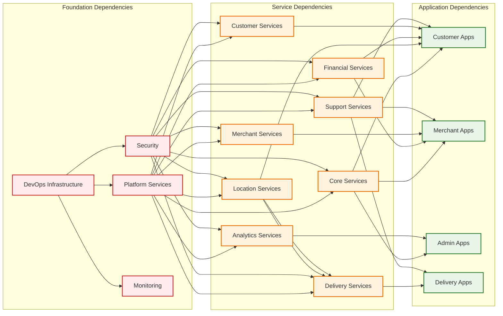
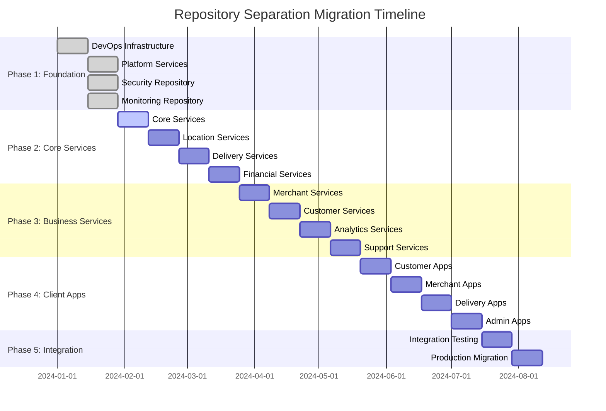

# 🏗️ Repository Separation Architecture Diagram

## 📊 **Repository Architecture Overview**

```mermaid
graph TB
    subgraph "Platform Foundation Layer"
        DevOps[msdp-devops-infrastructure<br/>DevOps/Platform Engineering]
        Platform[msdp-platform-services<br/>Platform Engineering]
        Security[msdp-security<br/>Security Engineering]
        Monitoring[msdp-monitoring<br/>SRE/Platform Engineering]
    end

    subgraph "Business Services Layer"
        Core[msdp-core-services<br/>Backend Engineering]
        Location[msdp-location-services<br/>Location Engineering]
        Delivery[msdp-delivery-services<br/>Delivery Engineering]
        Financial[msdp-financial-services<br/>Financial Engineering]
        Merchant[msdp-merchant-services<br/>Merchant Engineering]
        Customer[msdp-customer-services<br/>Customer Experience Engineering]
        Analytics[msdp-analytics-services<br/>Data Engineering]
        Support[msdp-support-services<br/>Support Engineering]
    end

    subgraph "Client Applications Layer"
        CustomerApps[msdp-customer-apps<br/>Frontend Engineering]
        MerchantApps[msdp-merchant-apps<br/>Frontend Engineering]
        DeliveryApps[msdp-delivery-apps<br/>Frontend Engineering]
        AdminApps[msdp-admin-apps<br/>Frontend Engineering]
    end

    %% Dependencies
    DevOps --> Platform
    DevOps --> Security
    DevOps --> Monitoring
    DevOps --> Core
    DevOps --> Location
    DevOps --> Delivery
    DevOps --> Financial
    DevOps --> Merchant
    DevOps --> Customer
    DevOps --> Analytics
    DevOps --> Support
    DevOps --> CustomerApps
    DevOps --> MerchantApps
    DevOps --> DeliveryApps
    DevOps --> AdminApps

    Platform --> Core
    Platform --> Location
    Platform --> Delivery
    Platform --> Financial
    Platform --> Merchant
    Platform --> Customer
    Platform --> Analytics
    Platform --> Support

    Security --> Core
    Security --> Location
    Security --> Delivery
    Security --> Financial
    Security --> Merchant
    Security --> Customer
    Security --> Analytics
    Security --> Support

    Monitoring --> Core
    Monitoring --> Location
    Monitoring --> Delivery
    Monitoring --> Financial
    Monitoring --> Merchant
    Monitoring --> Customer
    Monitoring --> Analytics
    Monitoring --> Support

    Core --> CustomerApps
    Core --> MerchantApps
    Core --> AdminApps

    Location --> Delivery
    Location --> CustomerApps

    Delivery --> DeliveryApps

    Financial --> CustomerApps
    Financial --> MerchantApps

    Merchant --> MerchantApps

    Customer --> CustomerApps

    Analytics --> AdminApps

    Support --> CustomerApps
    Support --> MerchantApps
    Support --> DeliveryApps

    %% Styling
    classDef platformLayer fill:#e1f5fe,stroke:#01579b,stroke-width:2px
    classDef businessLayer fill:#f3e5f5,stroke:#4a148c,stroke-width:2px
    classDef clientLayer fill:#e8f5e8,stroke:#1b5e20,stroke-width:2px

    class DevOps,Platform,Security,Monitoring platformLayer
    class Core,Location,Delivery,Financial,Merchant,Customer,Analytics,Support businessLayer
    class CustomerApps,MerchantApps,DeliveryApps,AdminApps clientLayer
```

## 🔄 **Repository Dependencies Flow**

## 📋 **Repository Responsibilities Matrix**

| Repository | Team | Primary Responsibilities | Dependencies | Dependents |
|------------|------|-------------------------|--------------|------------|
| **Platform Foundation** |
| `msdp-devops-infrastructure` | DevOps/Platform Engineering | Infrastructure, CI/CD, Deployment | None | All repositories |
| `msdp-platform-services` | Platform Engineering | Shared services, API Gateway, Common libraries | DevOps | All business services |
| `msdp-security` | Security Engineering | Security policies, Compliance, Access control | DevOps | All repositories |
| `msdp-monitoring` | SRE/Platform Engineering | Monitoring, Alerting, Observability | DevOps | All repositories |
| **Business Services** |
| `msdp-core-services` | Backend Engineering | User management, Orders, Reviews, Search | Platform, Security | All client apps |
| `msdp-location-services` | Location Engineering | Location intelligence, GPS tracking, Geocoding | Platform, Security | Delivery services, Customer apps |
| `msdp-delivery-services` | Delivery Engineering | Delivery operations, Courier management, Tracking | Platform, Location, Security | Delivery apps |
| `msdp-financial-services` | Financial Engineering | Payment processing, Billing, Payouts | Platform, Security | All client apps |
| `msdp-merchant-services` | Merchant Engineering | Merchant management, Catalog, Inventory | Platform, Security | Merchant apps |
| `msdp-customer-services` | Customer Experience Engineering | Customer support, Feedback, Loyalty | Platform, Security | Customer apps |
| `msdp-analytics-services` | Data Engineering | Business intelligence, ML, Reporting | Platform, Security | Admin apps |
| `msdp-support-services` | Support Engineering | Helpdesk, Ticketing, Knowledge base | Platform, Security | All client apps |
| **Client Applications** |
| `msdp-customer-apps` | Frontend Engineering | Customer mobile/web apps, PWA | Core, Location, Financial, Customer | None |
| `msdp-merchant-apps` | Frontend Engineering | Merchant mobile/web apps, Dashboard | Core, Merchant, Financial | None |
| `msdp-delivery-apps` | Frontend Engineering | Delivery partner apps, Tracking interface | Delivery, Location | None |
| `msdp-admin-apps` | Frontend Engineering | Admin dashboard, Analytics interface | Analytics, Core | None |

## 🚀 **Migration Timeline**

## 🎯 **Key Benefits**

### **Team Autonomy**
- **Independent Development**: Each team owns their repository and can work independently
- **Technology Freedom**: Teams can choose appropriate technologies for their domain
- **Release Cycles**: Independent release and deployment cycles
- **Ownership**: Clear ownership and accountability

### **Scalability**
- **Horizontal Scaling**: Easy to add new teams and repositories
- **Service Scaling**: Independent scaling of services based on demand
- **Team Scaling**: Easy to onboard new team members to specific domains
- **Geographic Scaling**: Support for distributed teams

### **Maintainability**
- **Focused Codebases**: Smaller, focused codebases are easier to maintain
- **Clear Boundaries**: Well-defined service boundaries reduce complexity
- **Reduced Coupling**: Loose coupling between services and repositories
- **Easier Debugging**: Easier to debug and troubleshoot specific domains

### **Security & Compliance**
- **Access Control**: Granular access control per repository
- **Security Scanning**: Focused security scanning and compliance
- **Audit Trails**: Clear audit trails per repository
- **Compliance**: Easier compliance management per domain

---

**This architecture provides a clear separation of concerns while maintaining the necessary dependencies and communication patterns for a successful multi-repository strategy.**
