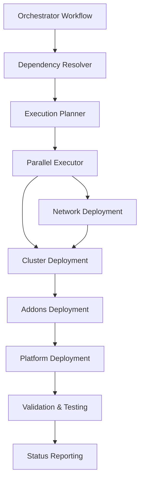

# Phase 2: Advanced Workflow Orchestration Plan

## Overview
Building on the successful Phase 1 refactoring, Phase 2 focuses on implementing advanced orchestration features to create intelligent workflow dependencies, automated environment promotion, and enhanced operational capabilities.

## Phase 2 Objectives

### 1. Intelligent Workflow Dependencies 🎯
**Goal**: Create smart dependency management between infrastructure components
- **Network → Clusters**: Automatically ensure network exists before cluster deployment
- **Clusters → Addons**: Verify cluster readiness before addon installation
- **Cross-Environment**: Manage promotion pipelines (dev → staging → prod)

### 2. Automated Environment Promotion 🚀
**Goal**: Streamline infrastructure changes across environments
- **Validation Gates**: Automated testing and validation before promotion
- **Approval Workflows**: Human approval gates for production changes
- **Rollback Capabilities**: Automated rollback on failure detection

### 3. Enhanced Monitoring & Observability 📊
**Goal**: Comprehensive visibility into pipeline health and infrastructure state
- **Workflow Metrics**: Success rates, execution times, failure patterns
- **Infrastructure State**: Real-time status of all components
- **Alert Integration**: Proactive notifications for issues

### 4. Advanced Templating & Configuration 🔧
**Goal**: Dynamic configuration generation and template-based deployments
- **Environment Templates**: Standardized environment blueprints
- **Dynamic Scaling**: Auto-scaling based on workload requirements
- **Configuration Drift Detection**: Automated detection and remediation

## Implementation Strategy

### Phase 2.1: Workflow Orchestration Engine
**Timeline**: 2-3 weeks
**Priority**: High

#### Components to Build:
1. **Workflow Dependency Manager**
   ```yaml
   # .github/workflows/orchestrator.yml
   name: Infrastructure Orchestrator
   on:
     workflow_dispatch:
       inputs:
         target_environment: [dev, staging, prod]
         components: [network, clusters, addons, platform]
         action: [plan, apply, destroy]
   ```

2. **State Management System**
   - Centralized state tracking across all components
   - Dependency resolution and execution ordering
   - Failure handling and recovery procedures

3. **Validation Framework**
   - Pre-deployment validation checks
   - Post-deployment verification tests
   - Health monitoring and alerting

#### Key Features:
- **Smart Ordering**: Automatically determine execution order based on dependencies
- **Parallel Execution**: Run independent components in parallel for speed
- **Failure Recovery**: Intelligent retry and rollback mechanisms
- **Progress Tracking**: Real-time visibility into orchestration progress

### Phase 2.2: Environment Promotion Pipeline
**Timeline**: 2-3 weeks
**Priority**: High

#### Components to Build:
1. **Promotion Workflow**
   ```yaml
   # .github/workflows/environment-promotion.yml
   name: Environment Promotion
   on:
     workflow_dispatch:
       inputs:
         source_environment: [dev, staging]
         target_environment: [staging, prod]
         components: [network, clusters, addons, platform]
   ```

2. **Validation Gates**
   - Automated testing suite for each component
   - Security scanning and compliance checks
   - Performance benchmarking

3. **Approval System**
   - Manual approval gates for production deployments
   - Stakeholder notification system
   - Audit trail and change tracking

#### Key Features:
- **Configuration Diff**: Show changes between environments
- **Staged Rollout**: Gradual deployment with monitoring
- **Automated Rollback**: Trigger rollback on failure detection
- **Change Documentation**: Automatic generation of change logs

### Phase 2.3: Monitoring & Observability
**Timeline**: 1-2 weeks
**Priority**: Medium

#### Components to Build:
1. **Pipeline Dashboard**
   - Real-time workflow status and metrics
   - Historical trend analysis
   - Performance optimization insights

2. **Infrastructure State Monitor**
   - Component health status
   - Resource utilization tracking
   - Cost optimization recommendations

3. **Alert System**
   - Proactive failure detection
   - Escalation procedures
   - Integration with existing monitoring tools

### Phase 2.4: Advanced Configuration Management
**Timeline**: 2-3 weeks
**Priority**: Medium

#### Components to Build:
1. **Environment Templates**
   - Standardized environment blueprints
   - Parameterized configuration generation
   - Version-controlled template library

2. **Dynamic Configuration**
   - Runtime parameter injection
   - Environment-specific overrides
   - Secrets management integration

3. **Drift Detection**
   - Automated configuration drift detection
   - Remediation recommendations
   - Compliance reporting

## Technical Implementation Details

### Orchestrator Architecture


### Key Technologies
- **GitHub Actions**: Workflow orchestration platform
- **Python**: Orchestration logic and state management
- **Terraform**: Infrastructure provisioning
- **Kubernetes**: Container orchestration
- **Prometheus/Grafana**: Monitoring and alerting

### State Management
```yaml
# orchestration-state.yaml
environments:
  dev:
    network:
      status: deployed
      version: v1.2.3
      last_updated: 2024-01-15T10:30:00Z
    clusters:
      aks-msdp-dev-01:
        status: deployed
        version: v1.31.2
        health: healthy
```

## Success Metrics

### Phase 2.1 Success Criteria
- [ ] Orchestrator can deploy full environment in correct order
- [ ] Dependency resolution works for all component combinations
- [ ] Failure recovery successfully handles common error scenarios
- [ ] Execution time reduced by 30% through parallelization

### Phase 2.2 Success Criteria
- [ ] Environment promotion completes without manual intervention
- [ ] Validation gates catch configuration issues before deployment
- [ ] Rollback procedures work reliably within 5 minutes
- [ ] Change documentation is automatically generated

### Phase 2.3 Success Criteria
- [ ] Dashboard provides real-time visibility into all workflows
- [ ] Alert system detects failures within 2 minutes
- [ ] Historical metrics enable performance optimization
- [ ] Cost tracking shows resource utilization trends

### Phase 2.4 Success Criteria
- [ ] Environment templates reduce setup time by 50%
- [ ] Drift detection identifies configuration changes within 1 hour
- [ ] Dynamic configuration supports all use cases
- [ ] Compliance reporting meets audit requirements

## Risk Assessment & Mitigation

### High Risk Items
1. **Complexity Management**: Orchestration logic becomes too complex
   - *Mitigation*: Incremental implementation with thorough testing
   
2. **State Consistency**: Race conditions in parallel execution
   - *Mitigation*: Proper locking mechanisms and state validation

3. **Failure Cascades**: One component failure affects entire pipeline
   - *Mitigation*: Circuit breaker patterns and isolation boundaries

### Medium Risk Items
1. **Performance Impact**: Orchestration overhead slows deployments
   - *Mitigation*: Performance testing and optimization
   
2. **Maintenance Overhead**: Complex system requires specialized knowledge
   - *Mitigation*: Comprehensive documentation and training

## Next Immediate Actions

1. **Create Orchestrator Workflow Skeleton** - Basic structure and inputs
2. **Implement Dependency Resolution Logic** - Component ordering algorithm
3. **Build State Management System** - Centralized state tracking
4. **Create Validation Framework** - Pre/post deployment checks
5. **Test with Existing Workflows** - Validate orchestration with current setup

## Timeline Summary
- **Phase 2.1**: 2-3 weeks (Orchestration Engine)
- **Phase 2.2**: 2-3 weeks (Environment Promotion)
- **Phase 2.3**: 1-2 weeks (Monitoring & Observability)
- **Phase 2.4**: 2-3 weeks (Advanced Configuration)

**Total Estimated Timeline**: 7-11 weeks

This plan builds on the solid foundation established in Phase 1 and creates a truly advanced, enterprise-grade CI/CD pipeline system.
