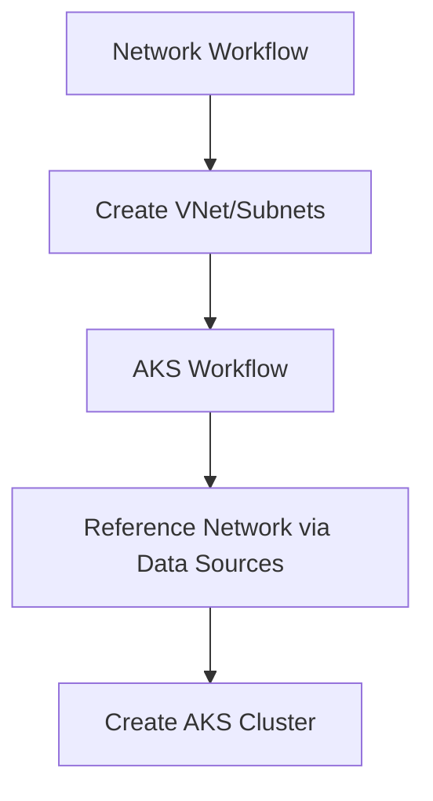

# Terraform Backend Strategy for Multi-Component Infrastructure

## Overview

This document outlines the strategy for managing Terraform backends in a multi-component infrastructure setup with GitHub Actions, focusing on isolation, reusability, and preventing resource conflicts.

## Architecture Principles

### 1. **Resource Ownership Separation**

Each workflow owns specific resources and never manages resources owned by others:

```
Network Workflow (azure-network-stack):
├── Resource Group (shared)
├── Virtual Network (shared)  
├── Subnets (shared)
└── Network Security Groups (shared)

AKS Workflow (aks):
├── AKS Cluster (per cluster)
├── Node Pools (per cluster)
└── References network via Azure data sources
```

### 2. **State Isolation**

Each workflow uses a unique Terraform state file:

```
S3 Backend Structure:
├── infra/msdp/dev/azure/network/azure-network-stack.tfstate
├── infra/msdp/dev/azure/aks/aks-dev-ops-01.tfstate
└── infra/msdp/dev/azure/aks/aks-dev-ops-02.tfstate
```

**Key Benefits:**
- No state conflicts between workflows
- Independent lifecycle management
- Parallel execution capability
- Clear ownership boundaries

### 3. **Dependency Management**

Instead of Terraform remote state dependencies, use Azure data sources:

```hcl
# In AKS module - Reference existing network
data "azurerm_subnet" "aks" {
  name                 = var.subnet_name
  virtual_network_name = var.vnet_name
  resource_group_name  = var.resource_group
}

resource "azurerm_kubernetes_cluster" "this" {
  # ... other config
  default_node_pool {
    vnet_subnet_id = data.azurerm_subnet.aks.id
  }
}
```

**Advantages:**
- Loose coupling between components
- No cross-state dependencies
- Resilient to state changes
- Simpler troubleshooting

## Implementation Guidelines

### Backend Configuration

#### 1. **Unique Pipeline Names**
Always provide a unique `pipeline-name` to ensure state isolation:

```yaml
- name: Setup Terraform Backend
  uses: ./.github/actions/terraform-backend
  with:
    pipeline-name: azure-network-stack  # Unique per workflow
    # ... other params
```

#### 2. **Consistent Naming Convention**
Use predictable naming patterns for state keys:

```
Pattern: {repo-shortname}/{project}/{env}/{cloud-segment}/{app}/{pipeline-name}.tfstate
Example: infra/msdp/dev/azure/network/azure-network-stack.tfstate
```

#### 3. **Shared Lock Table**
Use a shared DynamoDB lock table across all workflows:

```yaml
use-shared-lock-table: "true"
```

### Workflow Structure

#### Standard Workflow Steps:
1. **Checkout** - Get source code
2. **Authentication** - OIDC login to AWS + Azure
3. **Environment Bootstrap** - Set up environment variables
4. **Configuration Generation** - Create tfvars from config files
5. **Backend Setup** - Create/ensure S3 bucket and DynamoDB table
6. **Terraform Init** - Initialize with backend configuration
7. **Terraform Plan/Apply/Destroy** - Execute Terraform operations

#### Example Workflow Template:
```yaml
jobs:
  infrastructure:
    runs-on: ubuntu-latest
    env:
      ARM_CLIENT_ID: ${{ secrets.AZURE_CLIENT_ID }}
      ARM_SUBSCRIPTION_ID: ${{ secrets.AZURE_SUBSCRIPTION_ID }}
      ARM_TENANT_ID: ${{ secrets.AZURE_TENANT_ID }}
      ARM_USE_OIDC: "true"
    steps:
      - uses: actions/checkout@v4
      - name: Cloud Login
        uses: ./.github/actions/cloud-login
        # ... authentication steps
      - name: Setup Backend
        uses: ./.github/actions/terraform-backend
        # ... backend configuration
      - name: Terraform Init
        uses: ./.github/actions/terraform-init
        # ... initialization
      # ... plan/apply/destroy steps
```

## Resource Management Patterns

### 1. **Network-First Pattern**
Network infrastructure is created first and referenced by dependent services:



### 2. **Data Source References**
Use Azure data sources instead of remote state:

```hcl
# Good: Data source reference
data "azurerm_subnet" "aks" {
  name                 = var.subnet_name
  virtual_network_name = var.vnet_name
  resource_group_name  = var.resource_group
}

# Avoid: Remote state reference
data "terraform_remote_state" "network" {
  backend = "s3"
  config = {
    bucket = "terraform-state-bucket"
    key    = "network/terraform.tfstate"
    region = "eu-west-1"
  }
}
```

### 3. **Conditional Resource Creation**
Use variables to control resource creation:

```hcl
variable "manage_resource_group" {
  type        = bool
  description = "Create resource group or use existing"
  default     = true
}

resource "azurerm_resource_group" "this" {
  count    = var.manage_resource_group ? 1 : 0
  name     = var.resource_group
  location = var.location
}

data "azurerm_resource_group" "this" {
  count = var.manage_resource_group ? 0 : 1
  name  = var.resource_group
}
```

## Security Considerations

### 1. **OIDC Authentication**
Use GitHub OIDC for authentication (no long-lived credentials):

```yaml
permissions:
  id-token: write
  contents: read

env:
  ARM_USE_OIDC: "true"
```

### 2. **Least Privilege Access**
Grant minimal required permissions to service principals:
- Network workflow: Network Contributor on subscription
- AKS workflow: Contributor on resource group + Network Reader

### 3. **State Security**
- Enable S3 bucket encryption
- Use versioning for state files
- Restrict access to state bucket

## Troubleshooting

### Common Issues and Solutions

#### 1. **State Lock Errors**
```
Error: Error acquiring the state lock
```
**Solution:** Ensure DynamoDB table exists and has correct permissions.

#### 2. **Resource Already Exists**
```
Error: A resource with the ID already exists
```
**Solution:** Import existing resources or use data sources instead of creating new ones.

#### 3. **Backend Configuration Not Found**
```
Error: Backend config file not found
```
**Solution:** Ensure terraform-backend action runs before terraform-init.

#### 4. **Cross-Workflow Resource Conflicts**
**Solution:** Review resource ownership and ensure proper state isolation.

## Best Practices

### 1. **Testing Strategy**
- Always run `plan` before `apply`
- Test in development environment first
- Use separate backends for different environments

### 2. **State Management**
- Never edit state files manually
- Use `terraform import` for existing resources
- Regular state backups via S3 versioning

### 3. **Configuration Management**
- Store configuration in version-controlled YAML files
- Use consistent naming conventions
- Validate configuration before Terraform operations

### 4. **Monitoring and Alerting**
- Monitor workflow execution
- Alert on failed deployments
- Track resource drift

## Migration Strategy

### From Shared State to Isolated State

1. **Backup Current State**
   ```bash
   terraform state pull > backup.tfstate
   ```

2. **Create New Backend**
   ```bash
   terraform init -migrate-state
   ```

3. **Verify State Integrity**
   ```bash
   terraform plan
   ```

4. **Update Workflows**
   - Update backend configuration
   - Replace remote state with data sources
   - Test thoroughly

## Conclusion

This strategy provides:
- **Isolation**: Each component manages its own state
- **Flexibility**: Components can evolve independently  
- **Reliability**: Reduced risk of cross-component conflicts
- **Maintainability**: Clear ownership and dependencies

Follow these guidelines to build robust, scalable infrastructure automation with Terraform and GitHub Actions.