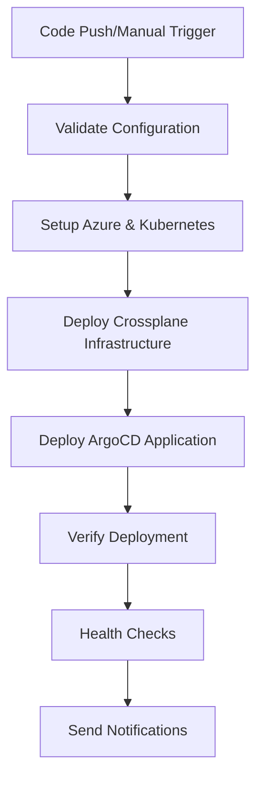

# MSDP Backstage Deployment

This directory contains the complete Backstage deployment configuration for the MSDP multi-business unit, multi-country platform using Crossplane and ArgoCD.

## 🏗️ Architecture Overview

```
┌─────────────────────────────────────────────────────────────────┐
│                    Crossplane Infrastructure                    │
│  ┌─────────────┐ ┌─────────────┐ ┌─────────────┐ ┌─────────────┐ │
│  │ PostgreSQL  │ │   Storage   │ │  Key Vault  │ │ App Insights│ │
│  │  Database   │ │   Account   │ │   Secrets   │ │  Monitoring │ │
│  └─────────────┘ └─────────────┘ └─────────────┘ └─────────────┘ │
└─────────────────────────────────────────────────────────────────┘
                                │
┌─────────────────────────────────────────────────────────────────┐
│                    ArgoCD Application                          │
│  ┌─────────────┐ ┌─────────────┐ ┌─────────────┐ ┌─────────────┐ │
│  │   Backstage │ │   Service   │ │   Ingress   │ │  Monitoring │ │
│  │   Backend   │ │   Catalog   │ │   Controller│ │   Stack     │ │
│  └─────────────┘ └─────────────┘ └─────────────┘ └─────────────┘ │
└─────────────────────────────────────────────────────────────────┘
```

## 📁 Directory Structure

```
infrastructure/kubernetes/backstage/
├── Chart.yaml                          # Helm chart metadata
├── values.yaml                         # Default values
├── templates/                          # Helm templates
│   ├── deployment.yaml
│   ├── service.yaml
│   ├── ingress.yaml
│   ├── configmap.yaml
│   └── secrets.yaml
├── dev/                                # Development environment
│   └── values-dev.yaml
├── staging/                            # Staging environment
│   └── values-staging.yaml
├── prod/                               # Production environment
│   └── values-prod.yaml
├── business-units/                     # Business unit specific configs
│   ├── values-platform-core.yaml
│   ├── values-food-delivery.yaml
│   ├── values-grocery-delivery.yaml
│   ├── values-cleaning-services.yaml
│   └── values-repair-services.yaml
├── countries/                          # Country specific configs
│   ├── values-uk.yaml
│   ├── values-india.yaml
│   └── values-global.yaml
└── templates/                          # Backstage service templates
    ├── msdp-microservice/
    ├── msdp-country-service/
    ├── msdp-business-unit-service/
    ├── msdp-platform-service/
    ├── msdp-shared-library/
    └── msdp-api-gateway/
```

## 🚀 Quick Start

### Prerequisites

1. **Crossplane** installed with Azure provider
2. **ArgoCD** installed and configured
3. **GitHub repository** with required secrets configured
4. **Azure credentials** configured for Crossplane

### Deploy Backstage

#### **Method 1: GitHub Actions (Recommended)**

**Automatic Deployment:**
```bash
# Deploy to production
git push origin main

# Deploy to staging
git push origin develop
```

**Manual Deployment:**
1. Go to **Actions** tab in GitHub
2. Select **"Deploy Backstage"**
3. Click **"Run workflow"**
4. Choose parameters:
   - Environment: `dev`, `staging`, `prod`
   - Business Unit: `platform-core`, `food-delivery`, etc.
   - Country: `global`, `uk`, `india`
   - Dry Run: `true`/`false`

#### **Method 2: Local Script (Legacy)**

```bash
# Deploy for development environment
./scripts/deploy-backstage.sh --environment dev

# Deploy for production with food delivery business unit in UK
./scripts/deploy-backstage.sh --environment prod --business-unit food-delivery --country uk

# Dry run to see what would be deployed
./scripts/deploy-backstage.sh --environment prod --dry-run
```

## 🔧 Configuration

### Environment Variables

The deployment uses environment variables for configuration:

```bash
# Azure Configuration
export AZURE_TENANT_ID="your-tenant-id"
export AZURE_SUBSCRIPTION_ID="your-subscription-id"
export AZURE_CLIENT_ID="your-client-id"
export AZURE_CLIENT_SECRET="your-client-secret"

# Database Configuration
export POSTGRES_HOST="your-postgres-host"
export POSTGRES_PORT="5432"
export POSTGRES_DATABASE="backstage_plugin_catalog"
export POSTGRES_USER="backstageadmin"

# Storage Configuration
export STORAGE_ACCOUNT_NAME="your-storage-account"
export STORAGE_CONTAINER_NAME="backstage-files"

# Key Vault Configuration
export KEY_VAULT_URI="https://your-keyvault.vault.azure.net/"

# Application Insights Configuration
export APP_INSIGHTS_CONNECTION_STRING="your-connection-string"
export APP_INSIGHTS_INSTRUMENTATION_KEY="your-instrumentation-key"

# Authentication Configuration
export SESSION_SECRET="your-session-secret"
export GITHUB_CLIENT_ID="your-github-client-id"
export GITHUB_CLIENT_SECRET="your-github-client-secret"

# Integration Configuration
export GITHUB_TOKEN="your-github-token"
export AZURE_TOKEN="your-azure-token"
export ARGOCD_PASSWORD="your-argocd-password"
```

### Custom Values

You can override default values by creating custom value files:

```yaml
# custom-values.yaml
backstage:
  app:
    title: "My Custom Backstage"
    organization:
      name: "My Organization"
  
  templates:
    - name: "my-custom-template"
      title: "My Custom Template"
      description: "Create a custom service"
      path: "templates/my-custom-template"
```

## 🌍 Multi-Business Unit Support

### Business Units

- **platform-core**: Core platform services and shared libraries
- **food-delivery**: Food delivery services and templates
- **grocery-delivery**: Grocery delivery services and templates
- **cleaning-services**: Cleaning services and templates
- **repair-services**: Repair and maintenance services

### Country Support

- **uk**: UK-specific configurations (GDPR, VAT, etc.)
- **india**: India-specific configurations (GST, FSSAI, etc.)
- **global**: Global configurations

## 📋 Service Templates

### Available Templates

1. **msdp-microservice**: Generic microservice template
2. **msdp-country-service**: Country-specific service template
3. **msdp-business-unit-service**: Business unit-specific service template
4. **msdp-platform-service**: Platform service template
5. **msdp-shared-library**: Shared library template
6. **msdp-api-gateway**: API Gateway template

### Creating Custom Templates

1. Create a new directory under `templates/`
2. Add template files (YAML, JSON, etc.)
3. Create a `template.yaml` file with metadata
4. Update the values file to include the new template

## 🔒 Security

### Secrets Management

- All secrets are stored in Azure Key Vault
- Secrets are automatically injected into the application
- No hardcoded secrets in configuration files

### Authentication

- GitHub OAuth integration
- Microsoft Azure AD integration
- Session-based authentication
- RBAC for service access

### Network Security

- TLS/SSL encryption for all communications
- Network policies for pod-to-pod communication
- Ingress controller with rate limiting
- WAF protection (optional)

## 📊 Monitoring

### Application Insights

- Performance monitoring
- Error tracking
- User analytics
- Custom metrics

### Prometheus Integration

- Service metrics
- Health checks
- Resource utilization
- Custom dashboards

### Grafana Dashboards

- Service overview
- Performance metrics
- Error rates
- User activity

## 🔄 CI/CD Integration

### GitHub Actions Workflows

The platform includes comprehensive GitHub Actions workflows for deployment, testing, and secrets management:

#### **1. Deploy Backstage (`deploy-backstage.yml`)**
- **Automatic deployment** on push to main/develop branches
- **Manual deployment** with custom parameters
- **Multi-environment support** (dev, staging, prod)
- **Multi-BU support** (platform-core, food-delivery, etc.)
- **Multi-country support** (UK, India, global)
- **Infrastructure validation** and health checks
- **No hardcoded values** - all configuration via environment variables

#### **2. Manage Secrets (`manage-secrets.yml`)**
- **Create secrets** for new deployments
- **Update secrets** with new values
- **Rotate secrets** for security
- **Validate secrets** for completeness

#### **3. Test Backstage (`test-backstage.yml`)**
- **Health checks** - Pod, service, and ingress health
- **Smoke tests** - Basic functionality testing
- **Integration tests** - API and service integration
- **Load tests** - Performance testing with k6
- **Security tests** - Security configuration validation

### ArgoCD Integration

- **Automatic synchronization** with Git repository
- **Health checks** and status monitoring
- **Rollback capabilities** for failed deployments
- **Multi-environment support** with environment-specific configurations
- **GitOps-driven** deployment with full audit trail

### Deployment Flow



## 🛠️ Troubleshooting

### Common Issues

1. **Infrastructure not ready**
   ```bash
   kubectl get xbackstageinfrastructure -n crossplane-system
   kubectl describe xbackstageinfrastructure <name> -n crossplane-system
   ```

2. **Application not synced**
   ```bash
   kubectl get application -n argocd
   kubectl describe application <name> -n argocd
   ```

3. **Pods not running**
   ```bash
   kubectl get pods -n backstage-<environment>
   kubectl logs <pod-name> -n backstage-<environment>
   ```

4. **Database connection issues**
   ```bash
   kubectl get secret backstage-<env>-secrets -n crossplane-system
   kubectl describe secret backstage-<env>-secrets -n crossplane-system
   ```

### Logs

```bash
# Backstage application logs
kubectl logs -f deployment/backstage -n backstage-<environment>

# ArgoCD application logs
kubectl logs -f deployment/argocd-application-controller -n argocd

# Crossplane logs
kubectl logs -f deployment/crossplane -n crossplane-system
```

## 📚 Additional Resources

- [Backstage Documentation](https://backstage.io/docs/)
- [Crossplane Documentation](https://crossplane.io/docs/)
- [ArgoCD Documentation](https://argo-cd.readthedocs.io/)
- [Helm Documentation](https://helm.sh/docs/)

## 🤝 Contributing

1. Fork the repository
2. Create a feature branch
3. Make your changes
4. Test the deployment
5. Submit a pull request

## 📄 License

This project is licensed under the MIT License - see the LICENSE file for details.
